<!-- README.md is generated from README.Rmd. Please edit README.Rmd file -->

## SamplingStrata: Optimal Stratification of Sampling Frames for Multipurpose Sampling Surveys

### Features

This package offers an approach for the determination of the best
stratification of a sampling frame, the one that ensures the minimum
sample cost under the condition to satisfy precision constraints in a
multivariate and multidomain case.

This approach is based on the use of the genetic algorithm: each
solution (i.e. a particular partition in strata of the sampling frame)
is considered as an individual in a population; the fitness of all
individuals is evaluated applying the Bethel-Chromy algorithm to
calculate the sampling size necessary to satisfy the precision
constraints on the target estimates.

Functions in the package allows to:

  - analyse the obtained results of the optimisation step;
  - assign the new strata labels to the sampling frame;
  - select a sample from the new frame accordingly to the best
    allocation.

## Installation

You can install SamplingStrata from github with:

``` r
# install.packages("devtools")
devtools::install_github("barcaroli/SamplingStrata")
```

# Procedural steps

The optimization of the sampling design starts by making the sampling
frame available, defining the target estimates of the survey and
establishing the precision constraints on them. It is then possible to
determine the best stratification and the optimal allocation. Finally,
we proceed with the selection of the sample. Formalizing, these are the
required steps:

  - analysis of the frame data: identification of available auxiliary
    information;
  - manipulation of auxiliary information: in case auxiliary variables
    are of the continuous type, they must be transformed into a
    categorical form;
  - construction of atomic strata: on the basis of the categorical
    auxiliary variables available in the sampling frame, a set of strata
    can be constructed by calculating the Cartesian product of the
    values of all the auxiliary variables;
  - characterization of each atomic stratum with the information related
    to the target variables: in order to optimise both strata and
    allocation of sampling units in strata, we need information on the
    distributions of the target variables (means and standard
    deviations) inside the different strata;
  - choice of the precision constraints for each target estimate,
    possibly differentiated by domain;
  - optimization of stratification and determination of required sample
    size and allocation in order to satisfy precision constraints on
    target estimates;
  - analysis of the resulting optimized strata;
  - association of new labels to sampling frame units, each of them
    indicating the new strata resulting by the optimal aggregation of
    the atomic strata;
  - selection of units from the sampling frame with a  selection scheme;
  - evaluation of the found optimal solution in terms of expected
    precision and bias.

In the following, we will illustrate each step starting from a real
sampling frame, the one that comes with the R package *sampling* (the
dataframe *swissmunicipalities*).

## Analysis of the frame data and manipulation of auxiliary information

As a first step, we have to define a frame dataframe containing the
following information:

  - a unique identifier of the unit (no restriction on the name, may be
    ‘cod’);
  - the values of m auxiliary variables (named from X1 to Xm);
  - the (optional) values of p target variables (named from Y1 to Yp);
  - the value of the domain of interest for which we want to produce
    estimates (named ‘domainvalue’).

By typing the following statements in the R environment:

``` r
library(SamplingStrata)
#> Loading required package: memoise
#> Loading required package: doParallel
#> Loading required package: foreach
#> Loading required package: iterators
#> Loading required package: parallel
#> Loading required package: pbapply
#> Loading required package: formattable
require(memoise)
data(swissmunicipalities)
```

we get the *swissmunicipalities* dataframe, that contains 2896
observations (each observation refers to a Swiss municipality). Among
the others, there are the following variables (data are referred to
2003):

  - REG: Swiss region
  - Nom: municipality name
  - Surfacesbois: wood area
  - Surfacescult: area under cultivation
  - Alp: mountain pasture area
  - Airbat: area with buildings
  - Airind: industrial area
  - Pop020: number of men and women aged between 0 and 19
  - Pop2040: number of men and women aged between 20 and 39
  - Pop4065: number of men and women aged between 40 and 64
  - Pop65P: number of men and women aged between 65 and over
  - POPTOT: total population

Let us suppose we want to plan a survey whose target estimates are the
totals of population by age class in each Swiss region. In this case,
our Y variables will be:

  - Y1: number of men and women aged between 0 and 19
  - Y2: number of men and women aged between 20 and 39
  - Y3: number of men and women aged between 40 and 64
  - Y4: number of men and women aged between 65 and over

As for the auxiliary variables (X’s), we can use all of those
characterising the area use (wood, mountain or pasture, cultivated,
industrial, with buildings).

Finally, we want to produce estimates not only for the whole country,
but also for each one of the seven different regions.

Function *buildFrameDF* permits to organize data in a suitable mode for
next processing:

``` r
swissmunicipalities$id <- c(1:nrow(swissmunicipalities))
swissframe <- buildFrameDF(df = swissmunicipalities,
                           id = "id",
                           X = c("POPTOT",
                                 "Surfacesbois",
                                 "Surfacescult",
                                 "Alp",
                                 "Airbat",
                                 "Airind"),
                           Y = c("Pop020",
                                 "Pop2040",
                                 "Pop4065",
                                 "Pop65P"),
                           domainvalue = "REG")
str(swissframe)
#> 'data.frame':    2896 obs. of  12 variables:
#>  $ id         : int  1 2 3 4 5 6 7 8 9 10 ...
#>  $ X1         : int  363273 177964 166558 128634 124914 90483 72626 59496 48655 40377 ...
#>  $ X2         : int  2326 67 97 1726 1635 2807 1139 408 976 425 ...
#>  $ X3         : int  967 31 93 1041 714 1827 1222 183 196 694 ...
#>  $ X4         : int  0 0 0 0 0 0 0 0 18 0 ...
#>  $ X5         : int  2884 773 1023 1070 856 972 812 524 463 523 ...
#>  $ X6         : int  260 60 213 212 64 238 134 27 108 137 ...
#>  $ Y1         : int  57324 32429 28161 19399 24291 18942 14337 9533 9127 8128 ...
#>  $ Y2         : int  131422 60074 50349 44263 44202 28958 24309 18843 14825 11265 ...
#>  $ Y3         : int  108178 57063 53734 39397 35421 27696 21334 18177 15140 13301 ...
#>  $ Y4         : int  66349 28398 34314 25575 21000 14887 12646 12943 9563 7683 ...
#>  $ domainvalue: int  4 1 3 2 1 4 5 6 2 2 ...
```

As the X variables are of the continuous type, first we have to reduce
them in a categorical (ordinal) form.

A suitable way to do so, is to apply a k-means clustering method \[see
@hartigan:1979\] by using the function *var.bin*:

``` r
library(SamplingStrata)
swissframe$X1 <- var.bin(swissmunicipalities$POPTOT, bins=18)
swissframe$X2 <- var.bin(swissmunicipalities$Surfacesbois, bins=3)
swissframe$X3 <- var.bin(swissmunicipalities$Surfacescult, bins=3)
swissframe$X4 <- var.bin(swissmunicipalities$Alp, bins=3)
swissframe$X5 <- var.bin(swissmunicipalities$Airbat, bins=3)
swissframe$X6 <- var.bin(swissmunicipalities$Airind, bins=3)
```

Now, we have six different auxiliary variables of the categorical type,
the first with 18 different modalities, the others with 3 modalities.

In any case, this dataframe comes with the package *SamplingStrata*: it
can be made available by executing:

``` r
library(SamplingStrata)
data(swissframe)
head(swissframe)
#>   progr REG X1 X2 X3 X4 X5 X6         id    Y1     Y2     Y3    Y4 domainvalue
#> 1     1   4 18  3  2  1  3  3     Zurich 57324 131422 108178 66349           4
#> 2     2   1 17  1  1  1  3  2     Geneve 32429  60074  57063 28398           1
#> 3     3   3 17  1  1  1  3  3      Basel 28161  50349  53734 34314           3
#> 4     4   2 17  2  3  1  3  3       Bern 19399  44263  39397 25575           2
#> 5     5   1 17  2  2  1  3  2   Lausanne 24291  44202  35421 21000           1
#> 6     6   4 16  3  3  1  3  3 Winterthur 18942  28958  27696 14887           4
```

We could also not indicate substantive X variables, if we want that each
unit in the sampling frame be considered as an atomic stratum, and let
to the optimization step to aggregate them on the basis of the values of
the Y variable. In any case, as we have to indicate at least one X
variable, we can use to this purpose the unique identifier in the frame:

``` r
swissmunicipalities$id <- c(1:nrow(swissframe))
newframe <- buildFrameDF(df = swissmunicipalities,
                         id = "id",
                         X = "id",
                         Y = c("Pop020",
                               "Pop2040",
                               "Pop4065",
                               "Pop65P"),
                         domainvalue = "REG")
str(newframe)
#> 'data.frame':    2896 obs. of  7 variables:
#>  $ id         : int  1 2 3 4 5 6 7 8 9 10 ...
#>  $ X1         : int  1 2 3 4 5 6 7 8 9 10 ...
#>  $ Y1         : int  57324 32429 28161 19399 24291 18942 14337 9533 9127 8128 ...
#>  $ Y2         : int  131422 60074 50349 44263 44202 28958 24309 18843 14825 11265 ...
#>  $ Y3         : int  108178 57063 53734 39397 35421 27696 21334 18177 15140 13301 ...
#>  $ Y4         : int  66349 28398 34314 25575 21000 14887 12646 12943 9563 7683 ...
#>  $ domainvalue: int  4 1 3 2 1 4 5 6 2 2 ...
```

## Construction of atomic strata and association of the information related to target variables

The *strata* dataframe reports information regarding each atomic stratum
in the population. There is one row for each stratum. The total number
of strata is given by the number of different combinations of X’s values
in the frame. For each stratum, the following information is required:

  - the identifier of the stratum (named ‘stratum’ or ‘strato’),
    concatenation of the values of the X variables;
  - the values of the m auxiliary variables (named from X1 to Xm)
    corresponding to those in the frame;
  - the total number of units in the population (named ‘N’);
  - a flag (named ‘cens’) indicating if the stratum is to be censused
    (=1) or sampled (=0);
  - a variable indicating the cost of interviewing per unit in the
    stratum (named ‘cost’);
  - for each target variable y, its mean and standard deviation, named
    respectively ‘Mi’ and ‘Si’);
  - the value of the domain of interest to which the stratum belongs
    (‘DOM1’).

For example:

``` r
data(strata)
head(strata)
#>   stratum    N  X1  X2  X3       M1       M2       S1       S2 cens cost DOM1
#> 1       1 2246 x11 x21 x31 148.1598 443.0137 95.41435 202.4569    0    1  tot
#> 2       2 2972 x11 x21 x32 184.2041 513.8995 81.26956 214.9999    0    1  tot
#> 3       3 1905 x11 x22 x31 193.8927 488.8046 79.66667 261.1876    0    1  tot
#> 4       4 3125 x11 x22 x32 181.3437 597.1925 82.77032 226.5086    0    1  tot
#> 5       5 1733 x12 x21 x31 109.9850 418.2234 88.20289 179.1571    0    1  tot
#> 6       6 1060 x12 x21 x32 114.7943 489.8292 52.71574 166.0292    0    1  tot
```

If in the *frame* dataframe are also present the values of the target Y
variables (from a census, or from administrative data), it is possible
to automatically generate the *strata* dataframe by invoking the
*buildStrataDF* function. Let us consider again the *swissframe* dataset
that we have built in previous steps. To this dataset we can apply the
function *buildStrataDF*:

``` r
  swissstrata <- buildStrataDF(swissframe, progress = FALSE)
#> 
#> Computations are being done on population data
#> 
#> Number of strata:  641
#> ... of which with only one unit:  389
```

This is the structure of the created dataframe:

``` r
head(swissstrata)
#>                  STRATO   N       M1        M2        M3       M4       S1
#> 1*1*1*1*1*1 1*1*1*1*1*1 184 48.31522  49.40217  61.44022 28.40761 26.81536
#> 1*1*1*1*1*2 1*1*1*1*1*2   1 98.00000 106.00000 116.00000 43.00000  0.00000
#> 1*1*1*2*1*1 1*1*1*2*1*1   2 57.00000  64.00000  70.00000 50.00000  4.00000
#> 1*1*2*1*1*1 1*1*2*1*1*1  11 77.72727  81.18182  92.36364 47.00000 15.24998
#> 1*2*1*1*1*1 1*2*1*1*1*1   9 58.22222  61.55556  66.77778 36.22222 25.46360
#> 1*2*1*2*1*1 1*2*1*2*1*1   8 61.00000  68.00000  84.62500 58.37500 24.56624
#>                   S2       S3       S4 COST CENS DOM1 X1 X2 X3 X4 X5 X6
#> 1*1*1*1*1*1 28.49831 32.63062 14.63922    1    0    1  1  1  1  1  1  1
#> 1*1*1*1*1*2  0.00000  0.00000  0.00000    1    0    1  1  1  1  1  1  2
#> 1*1*1*2*1*1  0.00000  1.00000 15.00000    1    0    1  1  1  1  2  1  1
#> 1*1*2*1*1*1 18.69768 17.03084 11.12736    1    0    1  1  1  2  1  1  1
#> 1*2*1*1*1*1 20.27100 24.89881 15.49751    1    0    1  1  2  1  1  1  1
#> 1*2*1*2*1*1 19.48076 26.35307 26.55625    1    0    1  1  2  1  2  1  1
```

It is worth while noting that the total number of different atomic
strata is 641, lower than the dimension of the Cartesian product of the
X’s (which is 4374): this is due to the fact that not all combinations
of the value of the auxiliary variables are present in the sampling
frame. Variables ‘cost’ and ‘cens’ are initialised respectively to 1 and
0 for all strata. It is possible to give them different values:

  - for variable ‘cost’, it is possible to differentiate the cost of
    interviewing per unit by assigning real values;
  - for variable ‘cens’, it is possible to set it equal to 1 for all
    strata that are of the ‘take-all’ type (i.e. all units in that
    strata must be selected).

The *swissstrata* dataframe comes together with *SamplingStrata*
package, it can be made available by typing:

``` r
data(swissstrata)
```

On the contrary, if there is no information in the frame regarding the
target variables, it is necessary to build the strata dataframe starting
from other sources, for instance a previous round of the same survey, or
from other surveys. In this case, we need to read sample data by
executing:

``` r
samp <- read.delim("samplePrev.txt")
```

The only difference is that computed mean and variances of the Y’s are
sampling estimates, whose reliability should be evaluated by carefully
considering their sampling variances. In addition to the naming
constraints previously introduced, this case requires that a variable
named ‘WEIGHT’ is present in the samp dataframe. Then we can execute
this function in this way:

``` r
strata <- buildStrataDF(samp)
```

The result is much the same than in the previous case: the function
creates a new dataframe, *strata*, and writes out in the working
directory the strata file, named ‘strata.txt’.

## Choice of the precision constraints for each target estimate

The *errors* dataframe contains the accuracy constraints that are set on
target estimates. This means to define a maximum coefficient of
variation for each variable and for each domain value. Each row of this
frame is related to accuracy constraints in a particular subdomain of
interest, identified by the *domainvalue* value. In the case of the
Swiss municipalities, we have chosen to define the following
constraints:

``` r
data(swisserrors)
swisserrors
#>    DOM  CV1  CV2  CV3  CV4 domainvalue
#> 1 DOM1 0.08 0.12 0.08 0.12           1
#> 2 DOM1 0.08 0.12 0.08 0.12           2
#> 3 DOM1 0.08 0.12 0.08 0.12           3
#> 4 DOM1 0.08 0.12 0.08 0.12           4
#> 5 DOM1 0.08 0.12 0.08 0.12           5
#> 6 DOM1 0.08 0.12 0.08 0.12           6
#> 7 DOM1 0.08 0.12 0.08 0.12           7
```

This example reports accuracy constraints on variables Y1, Y2, Y3 and Y4
that are the same for all the 7 different subdomains (Swiss regions) of
domain level DOM1. Of course we can differentiate the precision
constraints region by region. It is important to underline that the
values of ‘domainvalue’ are the same than those in the *frame*
dataframe, and correspond to the values of variable ‘DOM1’ in the strata
dataframe. Once having defined dataframes containing frame data, strata
information and precision constraints, it is worth while to check their
internal and reciprocal coherence. It is possible to do that by using
the function *checkInput*:

``` r
checkInput(errors = checkInput(errors = swisserrors, 
                               strata = swissstrata, 
                               sampframe = swissframe))
#> 
#> Input data have been checked and are compliant with requirements
#> 
#> No input data indicated
```

For instance, this function controls that the number of auxiliary
variables is the same in the *frame* and in the *strata* dataframes;
that the number of target variables indicated in the *frame* dataframe
is the same than the number of means and standard deviations in the
*strata* dataframe, and the same than the number of coefficient of
variations indicated in the *errors* dataframe.

If we try to determine the total size of the sample required to satisfy
these precision constraints, considering the current stratification of
the frame (the 641 atomic strata), we can do it by simply using the
function *bethel*. This function requires a slightly different
specification of the constraints dataframe:

``` r
cv <- swisserrors[1,]
cv
#>    DOM  CV1  CV2  CV3  CV4 domainvalue
#> 1 DOM1 0.08 0.12 0.08 0.12           1
```

because the *bethel* function does not permit to differentiate precision
constraints by subdomain. In any case, the result of the application of
the Bethel algorithm \[see bethel:1989\] is:

``` r
allocation <- bethel(swissstrata,cv)
sum(allocation)
#> [1] 893
```

That is, the required amount of units to be selected, with no
optimization of sampling strata. In general, after the optimization,
this number is sensibly reduced.

## Optimization of frame stratification

Once the strata and the constraints dataframes have been prepared, it is
possible to apply the function that optimises the stratification of the
frame, that is *optimStrata*. This function operates on all subdomains,
identifying the best solution for each one of them. T he first
fundamental parameter to be passed to optimStrata is *method*: this
parameter allows to choose the method to be applied in the optimization
step: (i) optimizeStrata (method = “atomic”); (ii) optimizeStrata2
(method = “continuous”); (iii) optimizeStrata (method = “spatial”).

The parameters common to all methods
are:

| Parameter       | Description                                                                    |
| --------------- | :----------------------------------------------------------------------------- |
| *errors*        | The (mandatory) dataframe containing the precision levels expressed in         |
|                 | terms of maximum allowable coefficient of variation on a given estimate        |
| *alldomains*    | Flag (TRUE/FALSE) to indicate if the optimization must be carried out on       |
|                 | all domains (default is TRUE). If it is set to FALSE, then a value must        |
|                 | be given to parameter *dom*                                                    |
| *dom*           | Indicates the domain on which the optimization must be carried                 |
| *strcens*       | Flag (TRUE/FALSE) to indicate if take-all strata do exist or not               |
|                 | (default is FALSE)                                                             |
| *minnumstr*     | Minimum number of units that must be allocated in each stratum                 |
|                 | (default is 2)                                                                 |
| *iter*          | Maximum number of iterations (= generations) of the genetic algorithm          |
|                 | (default is 50)                                                                |
| *pops*          | The dimension of each generations in terms of individuals (default is 20)      |
| *mut\_chance*   | Mutation chance, that is for each new individual, the probability to           |
|                 | change each single chromosome, i.e. one bit of the solution vector.            |
|                 | High values of this parameter allow a deeper exploration of the                |
|                 | solution space, but at a slower convergence, while low values permit           |
|                 | a faster convergence, but the final solution can be distant from the           |
|                 | optimal one. Default is NA, in correspondence of which it is computed          |
|                 | as 1/(vars+1) where vars is the length of elements in the solution             |
| *elitism\_rate* | This parameter indicates the rate of better solutions that must be             |
|                 | preserved from one generation to another (default is 0.2)                      |
| *suggestions*   | Optional parameter for genetic algorithm that indicates a suggested solution   |
|                 | to be introduced in the initial population. The most convenient is the         |
|                 | one found by the function “KmeanSolution” (default is NULL)                    |
| *writeFiles*    | Indicates if the various dataframes and plots produced during the execution    |
|                 | have to be written in the working directory (default is FALSE)                 |
| *showPlot*      | Indicates if the plot showing the trend in the value of the objective function |
|                 | has to be shown or not. Default is TRUE.                                       |
|                 | In parallel = TRUE, this defaults to FALSE                                     |
| *parallel*      | To indicate if the optimization has to be run in parallel (default is TRUE)    |
| *cores*         | If the analysis is run in parallel, how many cores should be used.             |
|                 | If not specified n-1 of total available cores are used OR if number            |
|                 | of domains \< (n-1) cores, then number of cores equal to number of domains     |
|                 | are used                                                                       |

The parameters specific for method “*atomic*”
are:

| Parameter         | Description                                                                       |
| ----------------- | :-------------------------------------------------------------------------------- |
| *strata*          | The name of the dataframe containing the information related to “atomic”          |
|                   | strata, i.e. the strata obtained by the Cartesian product of all                  |
|                   | auxiliary variables X’s. Information concerns the identifiability of              |
|                   | strata (values of X’s) and variability of Y’s (for each Y, mean and               |
|                   | standard error in strata)                                                         |
| *initialStrata*   | The initial limit on the number of strata in the different domains for            |
|                   | each solution. Default is NA, and in this case it is set equal to the             |
|                   | number of atomic strata in each domain                                            |
| *addStrataFactor* | The probability that at each mutation the number of strata may increase           |
|                   | with respect to the current value (default is 0.0)                                |
| *cens*            | The name of the dataframe containing the takeall strata, those strata whose units |
|                   | must be selected in whatever sample. It has same structure than “strata”          |
|                   | dataframe                                                                         |

The parameters common for methods “*continuous*” and “*spatial*”
are:

| Parameter   | Description                                                                |
| ----------- | :------------------------------------------------------------------------- |
| *framesamp* | The name of the dataframe containing the information related to the        |
|             | sampling frame                                                             |
| *framecens* | The name of the dataframe containing the units to be selected in any case. |
|             | It has same structure than “framesamp” dataframe                           |
| *nStrata*   | The number of strata to be obtained                                        |
| *model*     | In case the Y variables are not directly observed, but are estimated by    |
|             | means of other explicative variables, in order to compute the anticipated  |
|             | variance, information on models are given by a dataframe “model” with as   |
|             | many rows as the target variables. Default is NULL.                        |

The parameters specific for method “*spatial*”
are:

| Parameter | Description                                                                     |
| --------- | :------------------------------------------------------------------------------ |
| *fitting* | Fitting (in terms of r squared) of the spatial model(s) (default is 1)          |
| *range*   | Maximum range for spatial autocorrelation. It is a vector with as many elements |
|           | as the number of target variables Y                                             |
| *kappa*   | Constant used in evaluating spatial autocorrelation (default is 3)              |

In the case of the Swiss municipalities, we choose the “*atomic*” method
and make use of almost all of default values for parameters with the
exception of the errors and strata dataframes, and for the option
‘writeFiles’:

``` r
solution <- optimStrata(
  method = "atomic",
    errors = swisserrors, 
    strata = swissstrata,
    parallel = TRUE,
    writeFiles = FALSE,
    showPlot = FALSE)
#> 
#> Input data have been checked and are compliant with requirements
#> 
#>  *** Starting parallel optimization for  7  domains using  5  cores
```

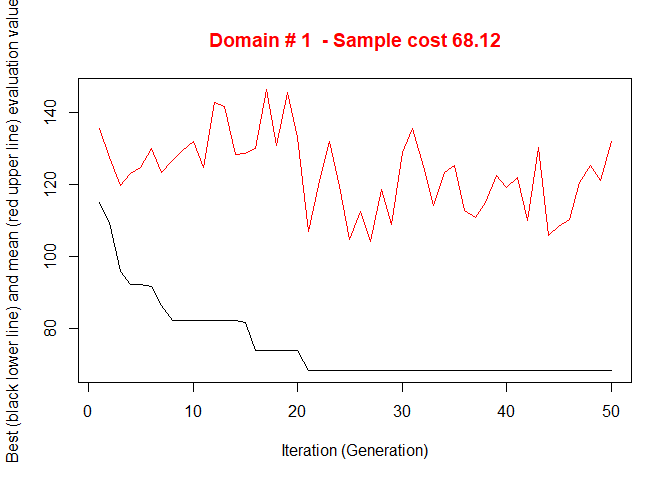<!-- -->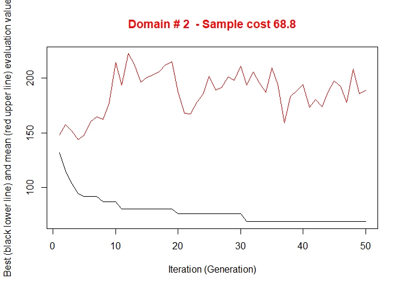<!-- -->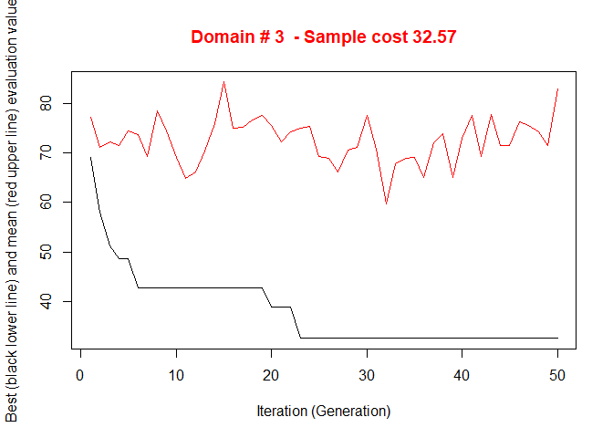<!-- -->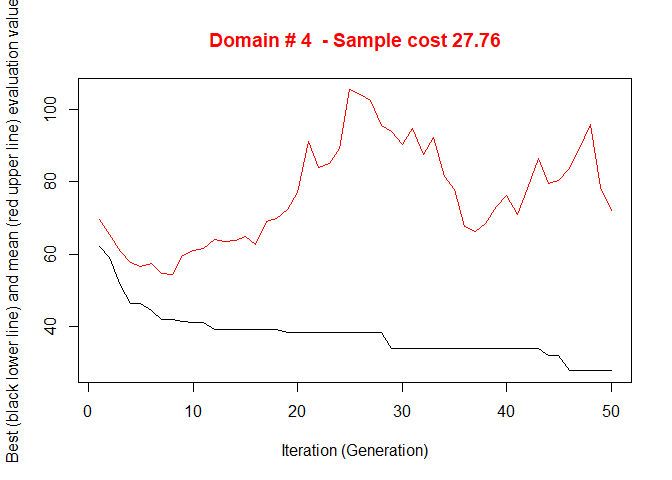<!-- -->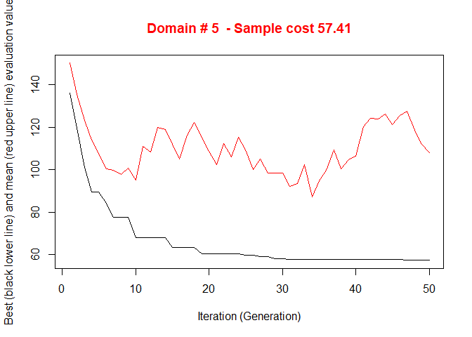<!-- -->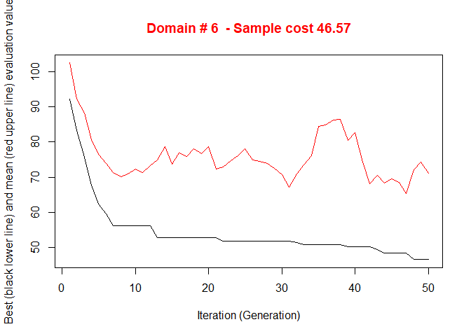<!-- -->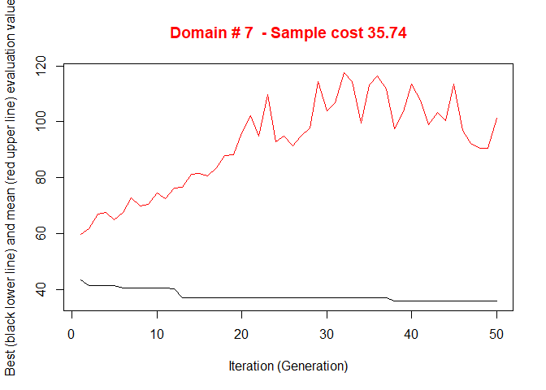<!-- -->

    #> 
    #>  *** Sample size :  332
    #>  *** Number of strata :  102
    #> ---------------------------

Note that by so doing the *initialStrata* parameter is set equal to the
number of atomic strata in each domain . Another possibility is to set a
pre-determined value for each domain, for instance equal in each domain,
as c(5,5,5,5,5,5,5,5).

The execution of *optimStrata* produces the solution of 7 different
optimization problems, one for each domain.

The graphs illustrate the convergence of the solution to the final one
starting from the initial one (i.e. the one related to the atomic
strata). Along the x-axis are reported the executed iterations, from 1
to the maximum, while on the y-axis are reported the size of the sample
required to satisfy precision constraints. The upper (red) line
represent the average sample size for each iteration, while the lower
(black) line represents the best solution found until the i-th
iteration.

The results of the execution are contained in the list ‘solution’,
composed by two elements:

1.  *solution$indices*: the vector of the indices that indicates to what
    aggregated stratum each atomic stratum belongs;
2.  *solution$aggr\_strata*: the dataframe containing information on the
    optimal aggregated strata.

We can calculate the expected CV’s by executing the function:

``` r
expected_CV(solution$aggr_strata)
#>      cv(Y1) cv(Y2) cv(Y3) cv(Y4)
#> DOM1  0.079  0.073  0.076  0.080
#> DOM2  0.078  0.077  0.080  0.092
#> DOM3  0.077  0.078  0.077  0.081
#> DOM4  0.078  0.074  0.078  0.078
#> DOM5  0.075  0.076  0.076  0.073
#> DOM6  0.074  0.075  0.079  0.077
#> DOM7  0.077  0.076  0.072  0.073
```

and compare them to the set of precision constraints in order to verify
the compliance:

``` r
swisserrors
#>    DOM  CV1  CV2  CV3  CV4 domainvalue
#> 1 DOM1 0.08 0.12 0.08 0.12           1
#> 2 DOM1 0.08 0.12 0.08 0.12           2
#> 3 DOM1 0.08 0.12 0.08 0.12           3
#> 4 DOM1 0.08 0.12 0.08 0.12           4
#> 5 DOM1 0.08 0.12 0.08 0.12           5
#> 6 DOM1 0.08 0.12 0.08 0.12           6
#> 7 DOM1 0.08 0.12 0.08 0.12           7
```

# Initial solution with kmeans clustering of atomic strata

In order to speed up the convergence towards the optimal solution, an
initial one can be given as a “suggestion” to ‘optimizeStrata’ function.
The function *KmeansSolution* produces this initial solution by
clustering atomic strata considering the values of the means of all the
target variables Y.

Also, the optimal number of clusters is determined inside each domain.
If the default value for nstrata is used, then the number of aggregate
strata is optimized by varying the number of cluster from 2 to number of
atomic strata in each domain, divided by 2. Otherwise, it is possible to
indicate a fixed number of aggregate strata to be obtained.

Other parameters are:

  - *minnumstrat*: the minimum number of units to be allocated in each
    stratum(default is 2);
  - *maxcluster*: the maximum number of clusters to be considered in the
    execution of kmeans algorithm;
  - *showPlot*: if TRUE, allows to visualise the optimization.

For any given number of clusters, the correspondent aggregation of
atomic strata is considered as input to the function ‘bethel’. The
number of clusters for which the value of the sample size necessary to
fulfil precision constraints is the minimum one, is retained as the
optimal one.

The overall solution is obtained by concatenating optimal clusters
obtained in domains. The result is a dataframe with two columns: the
first indicates the clusters, the second the domains:

``` r
solutionKmeans1 <- KmeansSolution(swissstrata,
                                   swisserrors,
                                   nstrata=NA,
                                   minnumstrat=2,
                                   maxclusters=NA,
                                   showPlot=FALSE)
#> 
#> -----------------
#>  Kmeans solution 
#> -----------------
#>  *** Domain:  1  ***
#>  Number of strata:  9
#>  Sample size     :  18
#>  *** Domain:  2  ***
#>  Number of strata:  9
#>  Sample size     :  17
#>  *** Domain:  3  ***
#>  Number of strata:  7
#>  Sample size     :  13
#>  *** Domain:  4  ***
#>  Number of strata:  6
#>  Sample size     :  10
#>  *** Domain:  5  ***
#>  Number of strata:  8
#>  Sample size     :  15
#>  *** Domain:  6  ***
#>  Number of strata:  7
#>  Sample size     :  13
#>  *** Domain:  7  ***
#>  Number of strata:  7
#>  Sample size     :  14
head(solutionKmeans1)
#>   suggestions domainvalue
#> 1           3           1
#> 2           3           1
#> 3           3           1
#> 4           3           1
#> 5           3           1
#> 6           3           1
```

This solution can be given as argument to the parameter *suggestion* in
the *optimizeStrata* function:

``` r
solution_with_kmeans <- optimStrata(
  method = "atomic",
    errors = swisserrors,
    strata = swissstrata,
    suggestions = solutionKmeans1,
    parallel = TRUE,
    writeFiles = TRUE,
    showPlot = FALSE)
#> 
#> Input data have been checked and are compliant with requirements
#> 
#>  *** Starting parallel optimization for  7  domains using  5  cores
#> 
#>  *** Sample size :  96
#>  *** Number of strata :  49
#> ---------------------------
#> ...written output to  C:/Users/Giulio/Google Drive/Sampling/SamplingStrata 1.5/SamplingStrataGithub/SamplingStrata/output /outstrata.txt
```

``` r
sum(ceiling(solution_with_kmeans$aggr_strata$SOLUZ))
#> [1] 98
```

thus obtaining a much more conventient solution than the one without the
kmeans suggestion, with the same number of iterations.

# Adjustment of the final sampling size

After the optimization step, the final sample size is the result of the
allocation of units in final strata. This allocation is such that the
precision constraints are expected to be satisfied. Actually, three
possible situations may occur:

  - the resulting sample size is acceptable;
  - the resulting sample size is to high, it is not affordable with
    respect to the available budget;
  - the resulting sample size is too low, the available budget permits
    to increase the number of units.

In the first case, no action is required. In the second case, it is
necessary to reduce the number of units, by equally applying the same
reduction rate in each stratum. In the third case, we could either to
set more tight precision constraints, or proceed to increase the sample
size by applying the same increase rate in each stratum. This
increase/reduction process is iterative, as by applying the same rate we
could find that in some strata there are not enough units to increase or
to reduce. The function *adjustSize* permits to obtain the desired final
sample size. Let us suppose that the obtained sample size is not
affordable. We can reduce it by executing the following
code:

``` r
adjustedStrata <- adjustSize(size=280,strata=solution$aggr_strata,cens=NULL)
#> 
#>  294
#>  293
#>  292
#>  292
#>  Final adjusted size:  292
sum(adjustedStrata$SOLUZ)
#> [1] 292
```

Instead, if we want to increase the size because the budget allows to do
this, then this is the
code:

``` r
adjustedStrata <- adjustSize(size=400,strata=solution$aggr_strata,cens=NULL)
#> 
#>  374
#>  382
#>  385
#>  387
#>  388
#>  389
#>  390
#>  390
#>  Final adjusted size:  390
sum(adjustedStrata$SOLUZ)
#> [1] 390
```

The difference between the desired sample size and the actual adjusted
size depends on the number of strata in the optimized solution. Consider
that the adjustment is performed in each stratum by taking into account
the relative difference between the current sample size and the desired
one: this produces an allocation that is expressed by a real number,
that must be rounded, while taking into account the requirement of the
minimum number of units in the strata. The higher the number of strata,
the higher the impact on the final adjusted sample size.

# Analysis of results

This function has two purposes:

1.  instrumental to the processing of the sampling frame (attribution of
    the labels of the optimized strata to the population units);
2.  analysis of the aggregation of the atomic strata obtained in the
    optimized solution.

The function *updateStrata* assigns the labels of the new strata to the
initial one in the dataframe *strata*, and produces:

  - a new dataframe named *newstrata* containing all the information in
    the *strata* dataframe, plus the labels of the new optimized strata;
  - a table, contained in the dataset *strata\_aggregation.txt*, showing
    in which way each optimized stratum aggregates the auxiliary
    variables X’s.

The function is invoked in this way:

``` r
newstrata <- updateStrata(swissstrata, 
                          solution, 
                          writeFiles = TRUE)
```

Now, the atomic strata are associated to the aggregate strata defined in
the optimal solution, by means of the variable *LABEL*. If we want to
analyse in detail the new structure of the stratification, we can look
at the *strata\_aggregation.txt* file:

``` r
strata_aggregation <- read.delim("strata_aggregation.txt")
head(strata_aggregation)
#>   DOM1 AGGR_STRATUM X1 X2 X3 X4 X5 X6
#> 1    1            1  1  1  1  1  1  1
#> 2    1            1  4  1  2  1  1  1
#> 3    1            1  4  2  1  1  1  1
#> 4    1            1  5  1  3  1  1  2
#> 5    1            1  7  2  1  2  1  2
#> 6    1            1  8  3  2  2  2  1
```

In this structure, for each aggregate stratum the values of the X’s
variables in each contributing atomic stratum are reported. It is then
possible to understand the meaning of each aggregate stratum produced by
the optimization.

# Updating the frame and selecting the sample

Once the optimal stratification has been obtained, to be operational we
need to accomplish the following two steps:

  - to update the frame units with new stratum labels (combination of
    the new values of the auxiliary variables X’s);
  - to select the sample from the frame.

As for the first, we execute the following command:

``` r
framenew <- updateFrame(swissframe, newstrata, writeFiles=FALSE)
```

The function *updateFrame* receives as arguments the indication of the
dataframe in which the frame information is memorised, and of the
dataframe produced by the execution of the *updateStrata* function. The
execution of this function produces a dataframe *framenew*, and also a
file (named *framenew.txt*) with the labels of the new strata produced
by the optimisation step. The allocation of units is contained in the
*SOLUZ* column of the dataset *outstrata.txt*. At this point it is
possible to select the sample from the new version of the frame:

``` r
sample <- selectSample(framenew, solution$aggr_strata, writeFiles=FALSE)
#> 
#> *** Sample has been drawn successfully ***
#>  332  units have been selected from  102  strata
#> 
#> ==> There have been  24  take-all strata 
#> from which have been selected  62 units
```

that produces two .csv files:

  - *sample.csv* containing the units of the frame that have been
    selected, together with the weight that has been calculated for each
    one of them;
  - *sample.chk.csv* containing information on the selection: for each
    stratum, the number of units in the population, the planned sample,
    the number of selected units, the sum of their weights that must
    equalise the number of units in the population.

The *selectSample* operates by drawing a simple random sampling in each
stratum.

A variant of this function is *selectSampleSystematic*. The only
difference is in the method used for selecting units in each strata,
that is by executing the following steps:

1.  a selection interval is determined by considering the inverse of the
    sampling rate in the stratum;
2.  a starting point is determined by selecting a value in this
    interval;
3.  the selection proceeds by selecting as first unit the one
    corresponding to the above value, and then selecting all the units
    individuated by adding the selection interval.

This selection method can be useful if associated to a particular
ordering of the selection frame, where the ordering variable(s) can be
considered as additional stratum variable(s). For instance, we could
decide that it could be important to consider the overall population in
municipalities when selecting units. Here is the code:

``` r
# adding POPTOT to framenew
data("swissmunicipalities")
framenew <- merge(framenew,swissmunicipalities[,c("REG","Nom","POPTOT")],
                  by.x=c("REG","ID"),by.y=c("REG","Nom"))
# selection of sample with systematic method
sample <- selectSampleSystematic(frame=framenew,
                                 outstrata=solution$aggr_strata,
                                 sortvariable = c("POPTOT"))
#> 
#> *** Sample has been drawn successfully ***
#>  332  units have been selected from  102  strata
#> 
#> ==> There have been  24  take-all strata 
#> from which have been selected  62 units
head(sample,3)
#>   DOMAINVALUE STRATO REG           ID     STRATUM PROGR X1 X2 X3 X4 X5 X6 Y1
#> 1           1      1   1     Birgisch 1*1*1*1*1*1  2456  1  1  1  1  1  1 52
#> 2           1      1   1  Champmartin 1*1*1*1*1*1  2886  1  1  1  1  1  1  5
#> 3           1      1   1 Cottens (VD) 1*1*1*1*1*1  2175  1  1  1  1  1  1 84
#>    Y2  Y3 Y4 LABEL POPTOT  WEIGHTS        FPC
#> 1  59  69 37     1    217 28.28571 0.03535354
#> 2   5  14  9     1     33 28.28571 0.03535354
#> 3 100 120 39     1    343 28.28571 0.03535354
```

# Evaluation of the found solution

In order to be confident about the quality of the found solution, the
function *evalSolution* allows to run a simulation, based on the
selection of a desired number of samples from the frame to which the
stratification, identified as the best, has been applied. The user can
invoke this function also indicating the number of samples to be drawn:

``` r
eval <- evalSolution(framenew, 
                     solution$aggr_strata, 
                     nsampl=200, 
                     writeFiles=FALSE,
                     progress=FALSE) 
```

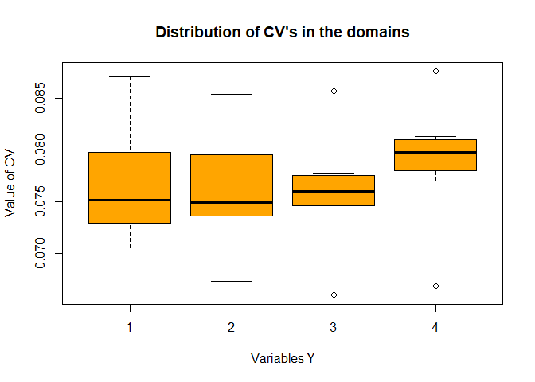<!-- -->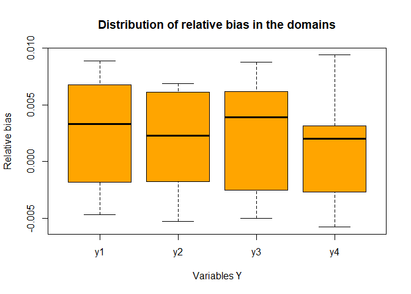<!-- -->

For each drawn sample, the estimates related to the Y’s are calculated.
Their mean and standard deviation are also computed, in order to produce
the CV related to each variable in every domain. These CV’s can be
inspected and compared to the constraints:

``` r
eval$coeff_var
#>      CV1    CV2    CV3    CV4  dom
#> 1 0.0780 0.0722 0.0767 0.0772 DOM1
#> 2 0.0752 0.0752 0.0764 0.0900 DOM2
#> 3 0.0754 0.0767 0.0749 0.0824 DOM3
#> 4 0.0782 0.0744 0.0763 0.0743 DOM4
#> 5 0.0821 0.0833 0.0827 0.0779 DOM5
#> 6 0.0808 0.0823 0.0849 0.0834 DOM6
#> 7 0.0856 0.0835 0.0804 0.0810 DOM7
swisserrors
#>    DOM  CV1  CV2  CV3  CV4 domainvalue
#> 1 DOM1 0.08 0.12 0.08 0.12           1
#> 2 DOM1 0.08 0.12 0.08 0.12           2
#> 3 DOM1 0.08 0.12 0.08 0.12           3
#> 4 DOM1 0.08 0.12 0.08 0.12           4
#> 5 DOM1 0.08 0.12 0.08 0.12           5
#> 6 DOM1 0.08 0.12 0.08 0.12           6
#> 7 DOM1 0.08 0.12 0.08 0.12           7
```

These values are on average compliant with the precision constraints
set.

We can also inspect the relative bias:

``` r
eval$rel_bias
#>        y1      y2      y3      y4  dom
#> 1 -0.0042 -0.0027 -0.0031 -0.0058 DOM1
#> 2  0.0055  0.0055  0.0055  0.0035 DOM2
#> 3  0.0005 -0.0009 -0.0020 -0.0013 DOM3
#> 4  0.0089  0.0067  0.0088  0.0094 DOM4
#> 5 -0.0047 -0.0053 -0.0050 -0.0041 DOM5
#> 6  0.0033  0.0023  0.0039  0.0028 DOM6
#> 7  0.0081  0.0069  0.0069  0.0020 DOM7
```

It is also possible to analyse the sampling distribution of the
estimates for each variable of interest in a selected domain:

``` r
dom = 1
hist(eval$est$Y1[eval$est$dom == dom], col = "grey", border = "white",
     xlab = expression(hat(Y)[1]),
     freq = FALSE,
     main = paste("Variable Y1 Domain ",dom,sep=""))
abline(v = mean(eval$est$Y1[eval$est$dom == dom]), col = "blue", lwd = 2)
abline(v = mean(swissframe$Y1[swissframe$domainvalue==dom]), col = "red")
legend("topright", c("distribution mean", "true value"),
       lty = 1, col = c("blue", "red"), box.col = NA, cex = 0.8)
```

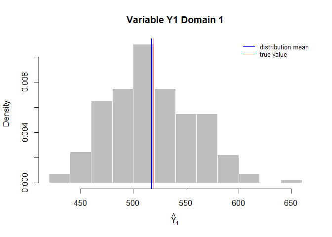<!-- -->

# Handling ‘take-all’ strata in the optimization step

As input to the optimization step, together with proper sampling strata,
it is also possible to provide *take-all* strata. These strata will not
be subject to optimisation as the proper strata, but they will
contribute to the determination of the best stratification, as their
presence in a given domain will permit to satisfy precision constraint
with a lower number of units belonging to proper sampling strata.

In order to correctly execute the optimization and further steps, it is
necessary to perform a pre-processing of the overall input. The first
step to be executed consists in the bi-partition of units to be censused
and of units to be sampled, in order to build two different frames. As
an example, we take the units with the highest values of the auxiliary
variables as the ones to be selected in any case:

``` r
data(swisserrors)
data(swissstrata)
data(swissframe)
#----Selection of units to be censused from the frame
ind_framecens <- which(swissframe$X1 > 12 |
                       swissframe$X2 > 2 | 
                       swissframe$X3 > 2 |
                       swissframe$X4 > 2 |
                       swissframe$X5 > 2 | 
                       swissframe$X6 > 2 )
framecens <- swissframe[ind_framecens,]
nrow(framecens)
#> [1] 302
#----Selection of units to be sampled from the frame
# (complement to the previous)
framesamp <- swissframe[-ind_framecens,]
nrow(framesamp)
#> [1] 2594
```

In this way, we have included all units to be surely selected in
‘framecens’, and the remaining in ‘framesamp’. At the end of the
process, the sample will be selected only from ‘framesamp’, while the
units in ‘framecens’ will be simply added to the sample.

We can obtain census strata and sampling strata by applying
*buildStrataDF* respectively to *framecens* and *framesamp*:

``` r
# Build strata to be censused and sampled
cens <- buildStrataDF(framecens,progress = FALSE)
#> 
#> Computations are being done on population data
#> 
#> Number of strata:  231
#> ... of which with only one unit:  187
sum(cens$N)
#> [1] 302
strata <- buildStrataDF(framesamp,progress = FALSE)
#> 
#> Computations are being done on population data
#> 
#> Number of strata:  410
#> ... of which with only one unit:  202
sum(strata$N)
#> [1] 2594
```

and

``` r
sum(cens$N)
#> [1] 302
sum(strata$N)
#> [1] 2594
```

Now we have all required inputs to run ‘optimStrata’ in presence of the
‘take-all’ strata:

``` r
solution <- optimStrata(
  method = "atomic",
    errors = swisserrors, 
    strata = strata, 
    cens = cens, 
    strcens = TRUE,
    parallel = TRUE,
    writeFiles = TRUE,
    showPlot = FALSE
)
#> 
#> Input data have been checked and are compliant with requirements
#> 
#>  *** Starting parallel optimization for  7  domains using  5  cores
#> 
#>  *** Sample size :  171
#>  *** Number of strata :  62
#> ---------------------------
#> ...written output to  C:/Users/Giulio/Google Drive/Sampling/SamplingStrata 1.5/SamplingStrataGithub/SamplingStrata/output /outstrata.txt
```

Once the optimized solution has been produced, the next steps are
executed by considering only the sampling part of the frame:

``` r
newstrata <- updateStrata(strata, solution)
# updating sampling frame with new strata labels
framenew <- updateFrame(frame=framesamp,newstrata=newstrata)
# selection of sample from sampling strata
sample <- selectSample(frame=framenew,outstrata=solution$aggr_strata)
#> 
#> *** Sample has been drawn successfully ***
#>  171  units have been selected from  62  strata
#> 
#> ==> There have been  10  take-all strata 
#> from which have been selected  14 units
```

Finally, the units in the ‘take-all’ strata can be added to sampled
ones. First, the census frame needs to be made homogeneous to the sample
frame in order to permit the ‘rbind’ step:

``` r
# addition of necessary variables to 
colnames(framesamp) <- toupper(colnames(framesamp))
colnames(framecens) <- toupper(colnames(framecens))
framecens$WEIGHTS <- rep(1,nrow(framecens))
framecens$FPC <- rep(1,nrow(framecens))
framecens$LABEL <- rep("999999",nrow(framecens))
framecens$STRATUM <- rep("999999",nrow(framecens))
framecens$STRATO <- rep("999999",nrow(framecens))
```

The overall set of units to be surveyed is obtainable in this way:

``` r
survey <- rbind(sample,framecens)
```

and this is the proportion of sampling and censused units:

``` r
survey$cens <- ifelse(survey$LABEL == "999999",1,0)
table(survey$cens)
#> 
#>   0   1 
#> 171 302
```

In order to verify compliance to the precision constraint, we perform
the following:

``` r
cens2 <- cens[,-c(14:19)]
cens2$SOLUZ <- cens2$N
stratatot <- rbind(solution$aggr_strata,cens2)
expected_CV(stratatot)
#>      cv(Y1) cv(Y2) cv(Y3) cv(Y4)
#> DOM1  0.080  0.074  0.080  0.077
#> DOM2  0.075  0.071  0.075  0.077
#> DOM3  0.077  0.076  0.076  0.081
#> DOM4  0.077  0.071  0.076  0.084
#> DOM5  0.078  0.076  0.080  0.082
#> DOM6  0.066  0.068  0.073  0.076
#> DOM7  0.075  0.073  0.072  0.075
```

# Handling Anticipated Variance

In the previous sections it has been assumed that, when optimizing the
stratification of a sampling frame, values of the target variables Y’s
are available for the generality of the units in the frame, or at least
for a sample of them by means of which it is possible to estimate means
and standard deviation of Y’s in atomic strata. Of course, this
assumption is seldom expected to hold. The situation in which some proxy
variables are available in the frame is much more likely to happen. In
these situations, instead of directly indicating the real target
variables, proxy ones are named as Y’s. By so doing, there is no
guarantee that the final stratification and allocation can ensure the
compliance to the set of precision constraints.  
In order to take into account this problem, and to limit the risk of
overestimating the expected precision levels of the optimized solution,
it is possible to carry out the optimization by considering, instead of
the expected coefficients of variation related to proxy variables, the
anticipated coefficients of variation (ACV) that depend on the model
that is possile to fit on couples of real target variables and proxy
ones. In the current implementation, only models linking continuous
variables can be considered. The definition and the use of these models
is the same that has been implemented in the package *stratification*
\[see @baillargeon:2014\]. In particular, the reference here is to two
different models, the linear model with heteroscedasticity:

\[Y=beta\times X + epsilon\]

where

\[epsilon \sim N(0,sig2 X^{gamma})\]

(in case gamma = 0, then the model is homoscedastic)

and the loglinear model:

\[Y= \exp (beta \times log(X) + epsilon)\]

where

\[epsilon \sim N(0,sig2)\]

In order to make evident the importance of the above, consider the
following example, based on the dataset *swissmunicipalities* available
in the package.

``` r
data("swissmunicipalities")
swissmunicipalities$id <- c(1:nrow(swissmunicipalities))
swissmunicipalities$dom <- 1
```

Let us assume that in the sampling frame only variable *total
population* is available for all municipalities, while *industrial area*
and *buildings area* are available only on a sample of 500
municipalities.

``` r
set.seed(1234)
swiss_sample <- swissmunicipalities[sample(c(1:nrow(swissmunicipalities)),500),]
```

In this subset we can fit models between POPTOT and the two variables
that we assume are the target of our survey.

One model for *industrial area* and *total population*:

``` r
mod_Airind_POPTOT <- lm(swiss_sample$Airind ~ swiss_sample$POPTOT)
summary(mod_Airind_POPTOT)
#> 
#> Call:
#> lm(formula = swiss_sample$Airind ~ swiss_sample$POPTOT)
#> 
#> Residuals:
#>     Min      1Q  Median      3Q     Max 
#> -48.466  -2.233  -1.400   0.502  82.261 
#> 
#> Coefficients:
#>                       Estimate Std. Error t value             Pr(>|t|)    
#> (Intercept)         1.11483284 0.43046222    2.59              0.00988 ** 
#> swiss_sample$POPTOT 0.00245734 0.00009303   26.41 < 0.0000000000000002 ***
#> ---
#> Signif. codes:  0 '***' 0.001 '**' 0.01 '*' 0.05 '.' 0.1 ' ' 1
#> 
#> Residual standard error: 8.309 on 498 degrees of freedom
#> Multiple R-squared:  0.5835, Adjusted R-squared:  0.5827 
#> F-statistic: 697.7 on 1 and 498 DF,  p-value: < 0.00000000000000022
```

and one model for *buildings area* and *total population*:

``` r
mod_Airbat_POPTOT <- lm(swiss_sample$Airbat ~ swiss_sample$POPTOT)
summary(mod_Airbat_POPTOT)
#> 
#> Call:
#> lm(formula = swiss_sample$Airbat ~ swiss_sample$POPTOT)
#> 
#> Residuals:
#>      Min       1Q   Median       3Q      Max 
#> -143.380  -12.223   -4.391    7.336  208.728 
#> 
#> Coefficients:
#>                       Estimate Std. Error t value            Pr(>|t|)    
#> (Intercept)         19.6788127  1.3203745   14.90 <0.0000000000000002 ***
#> swiss_sample$POPTOT  0.0119216  0.0002854   41.78 <0.0000000000000002 ***
#> ---
#> Signif. codes:  0 '***' 0.001 '**' 0.01 '*' 0.05 '.' 0.1 ' ' 1
#> 
#> Residual standard error: 25.49 on 498 degrees of freedom
#> Multiple R-squared:  0.778,  Adjusted R-squared:  0.7776 
#> F-statistic:  1745 on 1 and 498 DF,  p-value: < 0.00000000000000022
```

We calculate the heteroscedasticity index and associated prediction
standard error for both models:

``` r
airind <- computeGamma(mod_Airind_POPTOT$residuals,
             swiss_sample$POPTOT,
             nbins = 10)
```

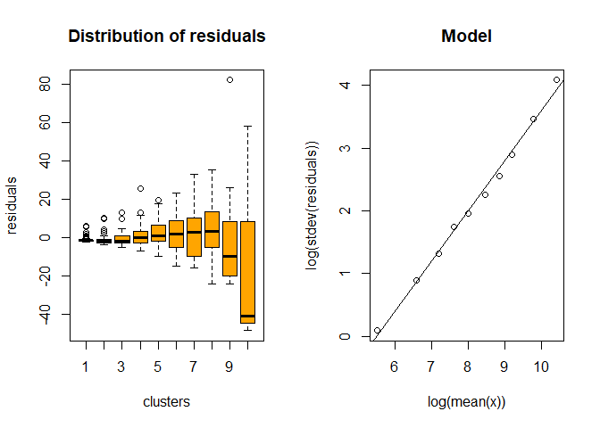<!-- -->

``` r
airind
#>      gamma      sigma   r.square 
#> 0.79952447 0.01229547 0.99476123
```

``` r
airbat <- computeGamma(mod_Airbat_POPTOT$residuals,
             swiss_sample$POPTOT,
             nbins = 10)
```

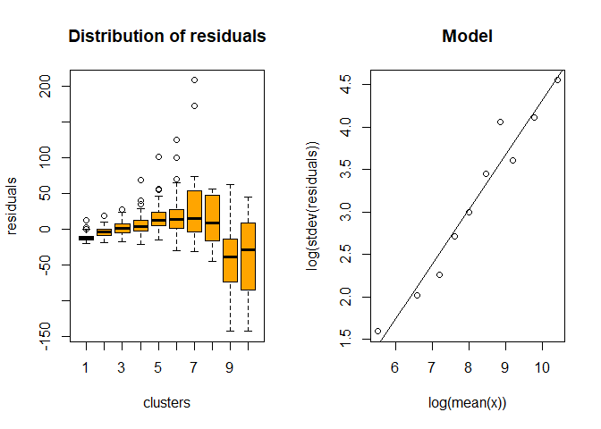<!-- -->

``` r
airbat
#>     gamma     sigma  r.square 
#> 0.6419641 0.1220129 0.9535845
```

We define the *sampling frame* in this way:

``` r
frame <- buildFrameDF(swissmunicipalities,
                      id="id",
                      X="id",
                      Y=c("POPTOT","POPTOT"),
                      domainvalue = "dom")
```

that is, we replicate twice the variable *GDP* because it will be used
once for *infant mortality* and once for *contraception*.

We set 10% and 5% precision constraints on these variables:

``` r
cv <- as.data.frame(list(DOM=rep("DOM1",1),
                         CV1=rep(0.10,1),
                         CV2=rep(0.05,1),
                         domainvalue=c(1:1)
                    ))
cv
#>    DOM CV1  CV2 domainvalue
#> 1 DOM1 0.1 0.05           1
```

We now proceed in building the *strata* dataframe using the models:

``` r
model <- NULL
model$beta[1] <- mod_Airind_POPTOT$coefficients[2]
model$sig2[1] <- airind[2]^2
model$type[1] <- "linear"
model$gamma[1] <- airind[1]
model$beta[2] <- mod_Airbat_POPTOT$coefficients[2]
model$sig2[2] <- airbat[2]^2
model$type[2] <- "linear"
model$gamma[2] <- airbat[1] 
model <- as.data.frame(model)
model
#>         beta         sig2   type     gamma
#> 1 0.00245734 0.0001511787 linear 0.7995245
#> 2 0.01192162 0.0148871469 linear 0.6419641
```

``` r
strata <- buildStrataDF(frame, model = model, progress = FALSE)
#> 
#> Computations are being done on population data
#> 
#> Number of strata:  2896
#> ... of which with only one unit:  2896
head(strata)
#>      STRATO N         M1         M2         S1        S2 COST CENS DOM1   X1
#> 1         1 1 892.685342 4330.80350 342.994959 452.76794    1    0    1    1
#> 10       10 1  99.220025  481.35934  59.219151 110.50409    1    0    1   10
#> 100     100 1  27.822006  134.97661  21.426738  48.85160    1    0    1  100
#> 1000   1000 1   3.695840   17.93012   4.266116  13.36856    1    0    1 1000
#> 1001   1001 1   3.688468   17.89436   4.259311  13.35144    1    0    1 1001
#> 1002   1002 1   3.683553   17.87051   4.254773  13.34001    1    0    1 1002
```

We proceed with the optimization

``` r
strata <- buildStrataDF(frame, model = model, progress = FALSE)
#> 
#> Computations are being done on population data
#> 
#> Number of strata:  2896
#> ... of which with only one unit:  2896
solution <-
  optimStrata(
    method = "atomic",
    errors = cv , 
    strata = strata, 
    iter = 50, 
    pops = 20, 
    parallel = FALSE,
    suggestions = KmeansSolution(strata,cv,maxclusters=10,showPlot=FALSE),
    showPlot = FALSE,
    writeFiles = FALSE)
#> 
#> Input data have been checked and are compliant with requirements
#> Sequential optimization as parallel = FALSE, defaulting number of cores = 1
#> -----------------
#>  Kmeans solution 
#> -----------------
#>  *** Domain:  1  ***
#>  Number of strata:  10
#>  Sample size     :  107
#>  *** Domain :  1   1
#>  Number of strata :  2896
#> ---------------------------------------------
#> Optimal stratification with Genetic Algorithm
#> ---------------------------------------------
#>  *** Parameters ***
#> ---------------------------
#> Domain:  1
#> Maximum number of strata:  2896
#> Minimum number of units per stratum:  2
#> Take-all strata (TRUE/FALSE):  FALSE
#> number of sampling strata :  2896
#> Number of target variables:  2
#> Number of domains:  1
#> Number of GA iterations:  50
#> Dimension of GA population:  20
#> Mutation chance in GA generation:  NA
#> Elitism rate in GA generation:  0.2
#> Chance to add strata to maximum:  0
#> Allocation with real numbers instead of integers:  TRUE
#>  *** Sample cost:  104.2297
#>  *** Number of strata:  10
```

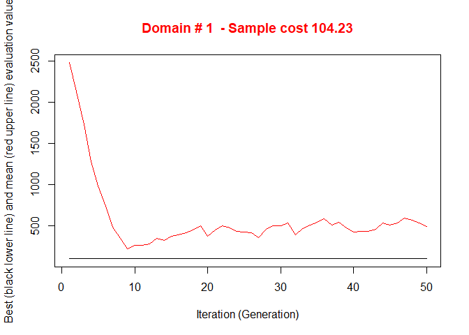<!-- -->

    #> 
    #>  *** Sample size :  105
    #>  *** Number of strata :  10
    #> ---------------------------

What about the expected CV’s?

``` r
newstrata <- updateStrata(strata,solution)
framenew <- updateFrame(frame,newstrata)
framenew <- framenew[order(framenew$ID),]
framenew$Y1 <- swissmunicipalities$Airind
framenew$Y2 <- swissmunicipalities$Airbat
results <- evalSolution(framenew, solution$aggr_strata, 200, progress = FALSE)
results$coeff_var
#>      CV1   CV2  dom
#> 1 0.0915 0.039 DOM1
```

These two CV’s regard respectively *industrial area* and *building
area*: they are more than compliant with the precision constraints (10%
and 5%).

# Optimization with the *continuous* method

When method “continuous” is chosen, *optimStrata* makes use of a
different genetic algorithm, operating on a genome represented by vector
containing real values, instead of integers. This permits to operate
directly on the boundaries of the strata, instead of aggregating the
initial atomic strata. In some situations (not exceedingly too big size
of the sampling frame) this new function is much more efficient.
Furthermore, resulting strata are guaranteed to not overlap with respect
to the different stratification variables. A major limitation is in the
nature of the stratification variables, that are required to be all
continuous (though categorical ordinal can be handled). Another one is
in the fact that it is necessary to choose the number of strata (it is
not optimally determined during the evolution process as in the case of
*atomic* method).

To operate with “*continuous*” method it is no more necessary to produce
the *strata* dataframe.

Let us consider the following example:

``` r
data("swissmunicipalities")
swissmunicipalities$id <- c(1:nrow(swissmunicipalities))
swissmunicipalities$dom <- 1
frame <- buildFrameDF(swissmunicipalities,
                      id = "id",
                      domainvalue = "REG",
                      X = c("Surfacesbois","Surfacescult"),
                      Y = c("Pop020", "Pop2040")
)
# choice of units to be selected in any case (census units)
framecens <- frame[frame$X1 > 2500 
                   | frame$X2 > 1200,]
# remaining units 
framesamp <- frame[!(frame$id %in% framecens$id),]
# precision constraints
errors <- NULL
errors$DOM <- "DOM1"
errors$CV1 <- 0.1
errors$CV2 <- 0.1
errors <- as.data.frame(errors)
errors <- errors[rep(row.names(errors),7),]
errors$domainvalue <- c(1:7)
errors
#>      DOM CV1 CV2 domainvalue
#> 1   DOM1 0.1 0.1           1
#> 1.1 DOM1 0.1 0.1           2
#> 1.2 DOM1 0.1 0.1           3
#> 1.3 DOM1 0.1 0.1           4
#> 1.4 DOM1 0.1 0.1           5
#> 1.5 DOM1 0.1 0.1           6
#> 1.6 DOM1 0.1 0.1           7
```

By so doing, we have chosen two stratification variables (*Surfacesbois*
and *Surfacescult*) and two target variables (*Pop020* and *Pop2040*),
on both of which we have set the same precision constraint (a maximum CV
equal to 10%).

Now the execution of the optimization step (for the domain 4) using
*optimizeStrata2* is straightforward, as we do not need to categorize
stratification variables and to generate the atomic strata:

``` r
solution <- optimStrata (
  method = "continuous",
  errors, 
  framesamp = framesamp,
  framecens = framecens, 
  strcens = TRUE, 
  alldomains = FALSE,
  dom = 4,
  iter = 50,
  pops = 20,
  nStrata = 5,
  writeFiles = FALSE,
  showPlot = FALSE,
  parallel = FALSE
)
#> 
#> Input data have been checked and are compliant with requirements
#> 
#> Input data have been checked and are compliant with requirements
#> 
#> Input data have been checked and are compliant with requirements
#> Sequential optimization as parallel = FALSE, defaulting number of cores = 1
#>  *** Sample cost:  32.85608
#>  *** Number of strata:  5
```

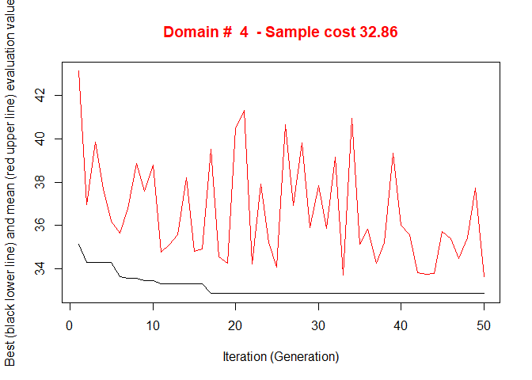<!-- -->

    #> 
    #>  *** Sample size :  28
    #>  *** Number of strata :  5
    #> ---------------------------

``` r
sum(round(solution$aggr_strata$SOLUZ))
#> [1] 34
expected_CV(solution$aggr_strata)
#>      cv(Y1) cv(Y2)
#> DOM1    0.1    0.1
```

This function also outputs the new version of the overall frame
(sampling plus census), already provided with the labels indicating to
which stratum each unit belongs:

``` r
framenew <- solution$framenew
table(framenew$LABEL)
#> 
#>  1  2  3  4  5  6 
#> 29 12 35 86  3  6
```

The first 5 strata are the ones pertaining to sampling units, the 6th is
the one with censused units.

To inspect the structure of the strata, the function *summaryStrata* is
available:

``` r
strataStructure <- summaryStrata(solution$framenew,solution$aggr_strata,progress=FALSE)
strataStructure
#>   Domain Stratum Population Allocation SamplingRate Lower_X1 Upper_X1 Lower_X2
#> 1      4       1         29          4     0.121036        5      172       40
#> 2      4       2         12          3     0.233469      145      297      128
#> 3      4       3         35          3     0.080425       21      509      210
#> 4      4       4         86         15     0.171273       33     1911      368
#> 5      4       5          3          3     1.000000      168     2326      967
#> 6      4       6          6          6     1.000000      261     2807     1204
#>   Upper_X2
#> 1      187
#> 2      202
#> 3      356
#> 4      890
#> 5     1142
#> 6     1827
```

It is also possible to visually investigate the distribution of
population units in the strata by using the function *plotStrata2d*:

``` r
outstrata <- plotStrata2d(
                  solution$framenew, 
                  solution$aggr_strata,
                  domain = 4, 
                  vars = c("X1","X2"),
                  labels =     c("Surfacesbois","Surfacescult")
                  )
```

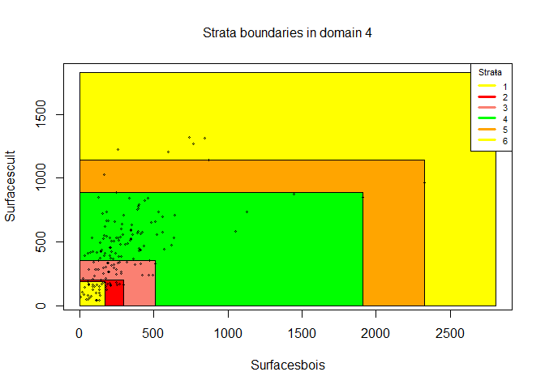<!-- -->

Together with the plot, also a tabular format of the optimized strata is
produced by *plotStrata2d*:

``` r
outstrata
```

<table class="table table-condensed">

<thead>

<tr>

<th style="text-align:right;">

Stratum

</th>

<th style="text-align:right;">

Population

</th>

<th style="text-align:right;">

Allocation

</th>

<th style="text-align:right;">

SamplingRate

</th>

<th style="text-align:right;">

Bounds Surfacesbois

</th>

<th style="text-align:right;">

Bounds
Surfacescult

</th>

</tr>

</thead>

<tbody>

<tr>

<td style="text-align:right;">

1

</td>

<td style="text-align:right;">

<span style="display: block; padding: 0 4px; border-radius: 4px; background-color: #bbe8cf">29</span>

</td>

<td style="text-align:right;">

<span style="display: block; padding: 0 4px; border-radius: 4px; background-color: #d4f3e2">4</span>

</td>

<td style="text-align:right;">

<span style="display: inline-block; direction: rtl; border-radius: 4px; padding-right: 2px; background-color: #FA614B; width: 12.10%">0.12103604</span>

</td>

<td style="text-align:right;">

5-172

</td>

<td style="text-align:right;">

40-187

</td>

</tr>

<tr>

<td style="text-align:right;">

2

</td>

<td style="text-align:right;">

<span style="display: block; padding: 0 4px; border-radius: 4px; background-color: #d2f2e0">12</span>

</td>

<td style="text-align:right;">

<span style="display: block; padding: 0 4px; border-radius: 4px; background-color: #def7e9">3</span>

</td>

<td style="text-align:right;">

<span style="display: inline-block; direction: rtl; border-radius: 4px; padding-right: 2px; background-color: #FA614B; width: 23.35%">0.23346940</span>

</td>

<td style="text-align:right;">

145-297

</td>

<td style="text-align:right;">

128-202

</td>

</tr>

<tr>

<td style="text-align:right;">

3

</td>

<td style="text-align:right;">

<span style="display: block; padding: 0 4px; border-radius: 4px; background-color: #b3e5c9">35</span>

</td>

<td style="text-align:right;">

<span style="display: block; padding: 0 4px; border-radius: 4px; background-color: #def7e9">3</span>

</td>

<td style="text-align:right;">

<span style="display: inline-block; direction: rtl; border-radius: 4px; padding-right: 2px; background-color: #FA614B; width: 8.04%">0.08042549</span>

</td>

<td style="text-align:right;">

21-509

</td>

<td style="text-align:right;">

210-356

</td>

</tr>

<tr>

<td style="text-align:right;">

4

</td>

<td style="text-align:right;">

<span style="display: block; padding: 0 4px; border-radius: 4px; background-color: #71ca97">86</span>

</td>

<td style="text-align:right;">

<span style="display: block; padding: 0 4px; border-radius: 4px; background-color: #71ca97">15</span>

</td>

<td style="text-align:right;">

<span style="display: inline-block; direction: rtl; border-radius: 4px; padding-right: 2px; background-color: #FA614B; width: 17.13%">0.17127342</span>

</td>

<td style="text-align:right;">

33-1911

</td>

<td style="text-align:right;">

368-890

</td>

</tr>

<tr>

<td style="text-align:right;">

5

</td>

<td style="text-align:right;">

<span style="display: block; padding: 0 4px; border-radius: 4px; background-color: #def7e9">3</span>

</td>

<td style="text-align:right;">

<span style="display: block; padding: 0 4px; border-radius: 4px; background-color: #def7e9">3</span>

</td>

<td style="text-align:right;">

<span style="display: inline-block; direction: rtl; border-radius: 4px; padding-right: 2px; background-color: #FA614B; width: 100.00%">1.00000000</span>

</td>

<td style="text-align:right;">

168-2326

</td>

<td style="text-align:right;">

967-1142

</td>

</tr>

<tr>

<td style="text-align:right;">

6

</td>

<td style="text-align:right;">

<span style="display: block; padding: 0 4px; border-radius: 4px; background-color: #daf5e6">6</span>

</td>

<td style="text-align:right;">

<span style="display: block; padding: 0 4px; border-radius: 4px; background-color: #c2ebd4">6</span>

</td>

<td style="text-align:right;">

<span style="display: inline-block; direction: rtl; border-radius: 4px; padding-right: 2px; background-color: #FA614B; width: 100.00%">1.00000000</span>

</td>

<td style="text-align:right;">

261-2807

</td>

<td style="text-align:right;">

1204-1827

</td>

</tr>

</tbody>

</table>

Finally, the selection of the sample is performed by using the same
function *selectSample*, but this time is no more necessary to handle
separately units to be sampled and units to be censused:

``` r
samp <- selectSample(solution$framenew,solution$aggr_strata)
#> 
#> *** Sample has been drawn successfully ***
#>  34  units have been selected from  6  strata
#> 
#> ==> There have been  2  take-all strata 
#> from which have been selected  9 units
```

# Optimization with the *spatial* method

In order to illustrate the “*spatial*” method, we make use of a dataset
generally employed as an example of spatially correlated phenomena (in
this case, the concentration of four heavy metals in a portion of the
river Meuse). This dataset comes with the library “*sp*”:

``` r
library(sp)
# locations (155 observed points)
data("meuse")
# grid of points (3103)
data("meuse.grid")
meuse.grid$id <- c(1:nrow(meuse.grid))
coordinates(meuse)<-c("x","y")
coordinates(meuse.grid)<-c("x","y")
```

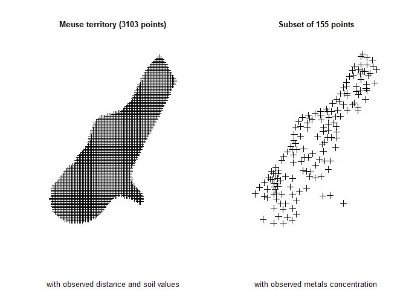<!-- -->

We analyse the territorial distribution of the lead concentration, and
model its relations with distance from the river and with the soil type,
by using the subset of 155 points on which these values have been
jointly observed:

``` r
library(gstat)
#> Registered S3 method overwritten by 'xts':
#>   method     from
#>   as.zoo.xts zoo
library(automap)
v <- variogram(lead ~ dist + soil, data=meuse)
fit.vgm <- autofitVariogram(lead ~ elev + soil, meuse, model = "Exp")
plot(v, fit.vgm$var_model)
```

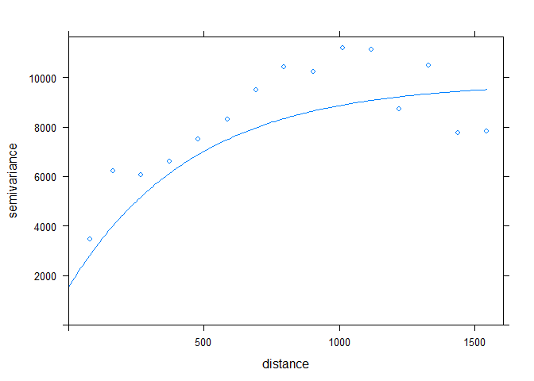<!-- -->

``` r
fit.vgm$var_model
#>   model    psill    range
#> 1   Nug 1524.895   0.0000
#> 2   Exp 8275.431 458.3303
```

``` r
g <- NULL
g <- gstat(g, "Pb", lead ~ dist + soil, meuse)
g
#> data:
#> Pb : formula = lead`~`dist + soil ; data dim = 155 x 12
vm <- variogram(g)
vm.fit <- fit.lmc(vm, g, vgm(psill=fit.vgm$var_model$psill[2], 
                  model="Exp", range=fit.vgm$var_model$range[2], 
                  nugget=fit.vgm$var_model$psill[1]))
```

Using this kriging model, we are able to predict the values of lead
concentration on the totality of the 3,103 points in the Meuse
territory:

``` r
# Prediction on the whole grid
preds <- predict(vm.fit, meuse.grid)
#> [using universal kriging]
names(preds)
#> [1] "Pb.pred" "Pb.var"
# [1] "Pb.pred" "Pb.var"
preds$Pb.pred <- ifelse(preds$Pb.pred < 0,0,preds$Pb.pred)
df <- NULL
df$Pb.pred <- preds@data$Pb.pred
df$Pb.var <- preds@data$Pb.var
df$dom1 <- 1
df <- as.data.frame(df)
df$id <- meuse.grid$id
```

The aim is now to produce the optimal stratification of the 3,103 points
under a precision constraint of 5% on the target estimate of the mean
lead concentration:

``` r
frame <- buildFrameDF(df=df,
                      id="id",
                      X=c("Pb.pred"),
                      Y=c("Pb.pred"),
                      domainvalue = "dom1")
frame$var1 <- df$Pb.var
frame$lon <- meuse.grid$x
frame$lat <- meuse.grid$y
cv <- as.data.frame(list(DOM=rep("DOM1",1),
                         CV1=rep(0.05,1),
                         domainvalue=c(1:1) ))
set.seed(1234)
solution <- optimStrata (
  method = "spatial",
  errors=cv, 
  framesamp=frame,
  iter = 50,
  pops = 10,
  nStrata = 3,
  fitting = 1,
  range = fit.vgm$var_model$range[2],
  kappa=1,
  writeFiles = FALSE,
  showPlot = FALSE,
  parallel = FALSE)
#> 
#> Input data have been checked and are compliant with requirements
#> Sequential optimization as parallel = FALSE, defaulting number of cores = 1
#>  *** Domain :  1   1
#>  Number of strata :  3103
#>  *** Sample cost:  127.3081
#>  *** Number of strata:  3
```

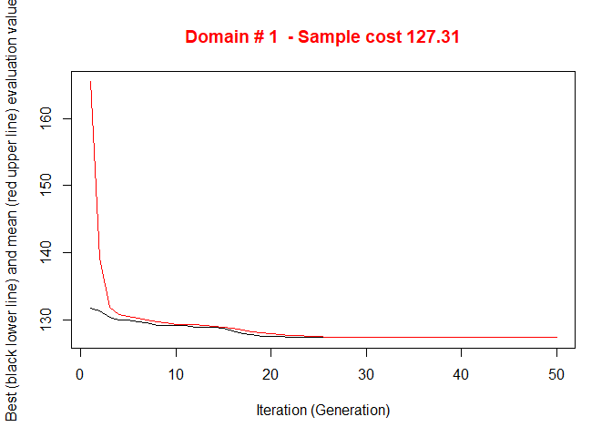<!-- -->

    #> 
    #>  *** Sample size :  128
    #>  *** Number of strata :  3
    #> ---------------------------
    framenew <- solution$framenew
    outstrata <- solution$aggr_strata

This is the structure of the obtained strata:

``` r
sum(round(outstrata$SOLUZ))
#> [1] 128
expected_CV(outstrata)
#>      cv(Y1)
#> DOM1   0.05
ss <- summaryStrata(framenew,outstrata)
#> 
  |                                                                            
  |                                                                      |   0%
  |                                                                            
  |======================================================================| 100%
ss
#>   Domain Stratum Population Allocation SamplingRate Lower_X1 Upper_X1
#> 1      1       1       1360         53     0.038906   0.0000 101.6446
#> 2      1       2       1073         43     0.039848 101.7265 198.1577
#> 3      1       3        670         32     0.047223 198.4284 502.9274
```

that can be visualised in this
way:

``` r
frameres <- SpatialPointsDataFrame(data=framenew, coords=cbind(framenew$LON,framenew$LAT) )
frameres2 <- SpatialPixelsDataFrame(points=frameres[c("LON","LAT")], data=framenew)
frameres2$LABEL <- as.factor(frameres2$LABEL)
spplot(frameres2,c("LABEL"), col.regions=bpy.colors(5))
```

<!-- -->
