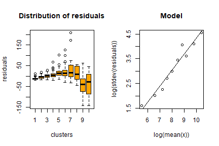
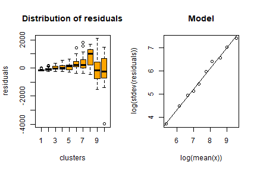
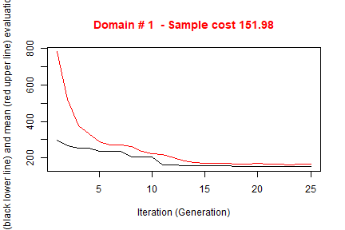

# Handling Anticipated Variance

When optimizing the stratification of a sampling frame, values of the target variables Y's are supposed to be available for the generality of the units in the frame, or at least for a sample of them by means of which it is possible to estimate means and standard deviation of Y's in atomic strata. 
Of course, this assumption is seldom expected to hold.
The situation in which some proxy variables are available in the frame is much more likely to happen. In these situations, instead
of directly indicating the real target variables, proxy ones are named as Y's.
By so doing, there is no guarantee that the final stratification and allocation can ensure the compliance to the set of precision constraints.  
In order to take into account this problem, and to limit the risk of overestimating the expected precision levels of the optimized solution, it is possible to carry out the optimization by  considering, instead of the expected coefficients of variation related to proxy variables, the anticipated coefficients of variation (ACV) that depend on the model that is possible to fit on couples of real target variables and proxy ones.

In the current implementation, the following restrictions hold:

* only models linking continuous variables can be considered;
* only *linear* or *loglinear* models;
* only one explanatory variable for each target variable.

The definition and the use of these models is the same that has been implemented in the package *stratification* [see @baillargeon2014]. 

In particular, the reference here is to two different models, the *linear model* with heteroscedasticity: 

$$Z=\beta Y + \epsilon$$

where 

$$\epsilon \sim N(0,\sigma^2 Y^\gamma)$$

(in case $\gamma = 0$, then the model is homoscedastic)

and the *loglinear model*: 

$$Z= \exp (\beta log(Y) + \epsilon)$$

where

$$\epsilon \sim N(0,\sigma^{2})$$

In *SamplingStrata*, the use of models to calculate the anticipated variance implies the execution of the following steps:

* for each couple *target variable Z* and *available variable in the frame Y* fit a model (linear or loglinear) using available data;
* in case of linear model, evaluate the heteroscedasticity of residuals (with the function *computeGamma*);
* with the above, define the *model* dataframe that is given as argument to the *optimStrata* function.

The *model* dataframe must contain a number of rows equal to the number of the Y variables.The coupling is positional: the first row refers to the Y1, the second row to Y2 and so on.

This is the structure of the *model* dataframe:


| Variable name |  Description                                                        |
| ------------- |:--------------------------------------------------------------------|
| *type*        | Can assume one of the two values: *linear* or *loglinear*           |
| *beta*        | Contains the value of the *beta* coefficient in the fitted model    |
| *sig2*        | Contains the value of the *model variance*.                         |
|               | It can be the squared value of sigma2 in the fitted model, or (only |
|               | for linear models) in case of heteroscedasticity it can be          |
|               | calculated with the *computeGamma* function                         |
| *gamma*       | Only for linear model: contains the value of the heteroscedasticity |          
|               | index (calculated with the *computeGamma* function)                 |

# Handling heteroscedasticity in linear models

When dealing with *linear* models, an evaluation of the quantity of heteroscedasticity in the residuals is of the utmost importance in order to correctly evaluate the anticipated variance (see @henry2006 and @knaub2019).
To this aim, a dedicated function has been developed: *computeGamma*. 
This function accepts as arguments the following:

* vector *e* of *residuals*;
* vector *x* of the *values* of the explanatory variable;
* number *nbins*  of groups of residuals/values with which to fit a model.

The function produces a vector of 3 values:

* the heteroscedasticity index;
* the model standard deviation be used together with the heteroscedasticity index;
* the $R^{2}$ of the fitted model used to estimate the two above values.

A suitable number to be given to the *nbins* parameter can be found by trying different values and choosing the one with which the value of the $R^{2}$ is the highest. Experience shows that a choice of *nbins* ranging between 10 to 16 works quite well.


# Example

Consider the following example, based on the dataset *swissmunicipalities* available in the package.


```r
library(SamplingStrata)
data("swissmunicipalities")
swissmunicipalities$id <- c(1:nrow(swissmunicipalities))
swissmunicipalities$dom <- 1
head(swissmunicipalities[,c(3,4,5,6,7,10,23)])
```

```
##   REG  COM        Nom HApoly Surfacesbois Airbat POPTOT
## 1   4  261     Zurich   8781         2326   2884 363273
## 2   1 6621     Geneve   1593           67    773 177964
## 3   3 2701      Basel   2391           97   1023 166558
## 4   2  351       Bern   5162         1726   1070 128634
## 5   1 5586   Lausanne   4136         1635    856 124914
## 6   4  230 Winterthur   6787         2807    972  90483
```

```r
cor(swissmunicipalities[,c(6,7,10,23)])
```

```
##                 HApoly Surfacesbois    Airbat    POPTOT
## HApoly       1.0000000    0.8094731 0.2075253 0.1060809
## Surfacesbois 0.8094731    1.0000000 0.2222185 0.1056776
## Airbat       0.2075253    0.2222185 1.0000000 0.9270286
## POPTOT       0.1060809    0.1056776 0.9270286 1.0000000
```

Let us assume that in the sampling frame only variables *total population* (*POPTOT*) and 
*total area* (*HApoly*) are available for all municipalities, while *buildings area* (*Airbat*)
and *wooded area* (*Surfacesbois*) are available only on a sample of 500 municipalities.


```r
set.seed(1234)
swiss_sample <- swissmunicipalities[sample(c(1:nrow(swissmunicipalities)),500),]
```


In this subset we can fit models between POPTOT and HAPOLY and the two variables that we assume are the target of our survey.

One model for *buildings area* and *total population*:


```r
mod_Airbat_POPTOT <- lm(swiss_sample$Airbat ~ swiss_sample$POPTOT)
summary(mod_Airbat_POPTOT)
```

```
## 
## Call:
## lm(formula = swiss_sample$Airbat ~ swiss_sample$POPTOT)
## 
## Residuals:
##      Min       1Q   Median       3Q      Max 
## -143.380  -12.223   -4.391    7.336  208.728 
## 
## Coefficients:
##                      Estimate Std. Error t value Pr(>|t|)    
## (Intercept)         1.968e+01  1.320e+00   14.90   <2e-16 ***
## swiss_sample$POPTOT 1.192e-02  2.854e-04   41.78   <2e-16 ***
## ---
## Signif. codes:  0 '***' 0.001 '**' 0.01 '*' 0.05 '.' 0.1 ' ' 1
## 
## Residual standard error: 25.49 on 498 degrees of freedom
## Multiple R-squared:  0.778,	Adjusted R-squared:  0.7776 
## F-statistic:  1745 on 1 and 498 DF,  p-value: < 2.2e-16
```

and one model for *wooded area* and *total area*:


```r
mod_Surfacesbois_HApoly <- lm(swiss_sample$Surfacesbois ~ swiss_sample$HApoly)
summary(mod_Surfacesbois_HApoly)
```

```
## 
## Call:
## lm(formula = swiss_sample$Surfacesbois ~ swiss_sample$HApoly)
## 
## Residuals:
##     Min      1Q  Median      3Q     Max 
## -3979.1  -152.5   -87.7    98.0  2107.3 
## 
## Coefficients:
##                      Estimate Std. Error t value Pr(>|t|)    
## (Intercept)         1.545e+02  1.921e+01   8.043 6.46e-15 ***
## swiss_sample$HApoly 1.997e-01  7.415e-03  26.932  < 2e-16 ***
## ---
## Signif. codes:  0 '***' 0.001 '**' 0.01 '*' 0.05 '.' 0.1 ' ' 1
## 
## Residual standard error: 371.1 on 498 degrees of freedom
## Multiple R-squared:  0.5929,	Adjusted R-squared:  0.5921 
## F-statistic: 725.4 on 1 and 498 DF,  p-value: < 2.2e-16
```

We calculate the heteroscedasticity index and associated prediction standard error for both models:


```r
Airbat <- computeGamma(mod_Airbat_POPTOT$residuals,
             swiss_sample$POPTOT,
             nbins = 10)
```



```r
Airbat
```

```
##     gamma     sigma  r.square 
## 0.6419641 0.1220129 0.9535845
```


```r
Surfacesbois <- computeGamma(mod_Surfacesbois_HApoly$residuals,
             swiss_sample$HApoly,
             nbins = 10)
```



```r
Surfacesbois
```

```
##     gamma     sigma  r.square 
## 0.8911053 0.3582789 0.9931305
```

We now proceed in building the *model* dataframe using the above models:


```r
model <- NULL
model$beta[1] <- mod_Airbat_POPTOT$coefficients[2]
model$sig2[1] <- Airbat[2]^2
model$type[1] <- "linear"
model$gamma[1] <- Airbat[1]
model$beta[2] <- mod_Surfacesbois_HApoly$coefficients[2]
model$sig2[2] <- Surfacesbois[2]^2
model$type[2] <- "linear"
model$gamma[2] <- Surfacesbois[1] 
model <- as.data.frame(model)
model
```

```
##         beta       sig2   type     gamma
## 1 0.01192162 0.01488715 linear 0.6419641
## 2 0.19970325 0.12836378 linear 0.8911053
```


We define the *sampling frame* in this way:


```r
frame <- buildFrameDF(swissmunicipalities,
                      id = "COM",
                      domainvalue = "dom",
                      X = c("POPTOT", "HApoly"),
                      Y = c("POPTOT", "HApoly"))
frame$Airbat <- swissmunicipalities$Airbat
frame$Surfacesbois <- swissmunicipalities$Surfacesbois
```

Note that the explanatory variables in the models have been set as both target variables Y and stratification variables X. 

(Since in this exercise the true values of the variables of interest are known for each unit of the population, they have been included in the frame in order to allow a performance evaluation in the next step. It is quite clear that this knowledge is not available in real cases.)

We set 5% precision constraint on both variables:


```r
cv <- as.data.frame(list(DOM=rep("DOM1",1),
                         CV1=rep(0.05,1),
                         CV2=rep(0.05,1),
                         domainvalue=c(1:1)
                    ))
cv
```

```
##    DOM  CV1  CV2 domainvalue
## 1 DOM1 0.05 0.05           1
```


We can now proceed with the optimization step:


```r
set.seed(1234)
solution <- optimStrata(
    method = "continuous",
    errors = cv , 
    framesamp = frame, 
    model = model,
    iter = 25, 
    pops = 20, 
    parallel = FALSE,
    nStrata = 5,
    showPlot = FALSE,
    writeFiles = FALSE)
```

```
## 
## Input data have been checked and are compliant with requirements
## 
## -------------------------------------------------------
##  *** Domain :  1
##  Number of strata :  2896
##  *** Sample cost:  295.1979
##  *** Number of strata:  5
```


```
## 
##  *** Sample size :  296
##  *** Number of strata :  5
## ---------------------------
```


What about the expected CV's? We attribute the real values of Airbat and Surfacesbois to the Ys of obtained *framenew* and run the simulation:


```r
outstrata <- solution$aggr_strata
framenew <- solution$framenew
framenew$Y3 <- framenew$AIRBAT
framenew$Y4 <- framenew$SURFACESBOIS
results <- evalSolution(framenew, outstrata, 500, progress = FALSE)
```

```
## Warning in evalSolution(framenew, outstrata, 500, progress = FALSE): Folder C:/Users/UTENTE/Google Drive/Sampling/SamplingStrata 1.5/vignettes/simulation already existed and has been deleted.
```

```r
results$coeff_var
```

```
##      CV1    CV2    CV3    CV4  dom
## 1 0.0369 0.0241 0.0352 0.0366 DOM1
```

The first two CVs pertain to the proxy available variables, namely *total population* and *total area*, while the last two
regard respectively *buildings area* and *wooded area*: they are more than compliant with the precision constraint of 5%.

What if we did not use the information contained in models?
We run the same optimization step without indicating any model parameter:


```r
set.seed(1234)
solution <- optimStrata(
    method = "continuous",
    errors = cv , 
    framesamp = frame, 
    model = NULL,
    iter = 25, 
    pops = 20, 
    parallel = FALSE,
    nStrata = 5,
    showPlot = FALSE,
    writeFiles = FALSE)
```

```
## 
## Input data have been checked and are compliant with requirements
## 
## -------------------------------------------------------
##  *** Domain :  1
##  Number of strata :  2896
##  *** Sample cost:  151.9848
##  *** Number of strata:  5
```



```
## 
##  *** Sample size :  152
##  *** Number of strata :  5
## ---------------------------
```


We obtain a solution that requires a much lower sample size to satisfy the precision constraints on the Ys. But as we did not consider the anticipated variance on the real target variables, we pay a price in terms of expected CVs on them:


```r
outstrata <- solution$aggr_strata
framenew <- solution$framenew
framenew$Y3 <- framenew$AIRBAT
framenew$Y4 <- framenew$SURFACESBOIS
results <- evalSolution(framenew, outstrata, 500, progress = FALSE)
```

```
## Warning in evalSolution(framenew, outstrata, 500, progress = FALSE): Folder C:/Users/UTENTE/Google Drive/Sampling/SamplingStrata 1.5/vignettes/simulation already existed and has been deleted.
```

```r
results$coeff_var
```

```
##      CV1    CV2    CV3    CV4  dom
## 1 0.0501 0.0491 0.0502 0.0686 DOM1
```

Norwithstanding the non inclusion of the models in the optimization step, the CV related to *buildings area* is still inside the limit of the 5%: this is most likely due to the high correlation between *buildings area* and *total population*. While the lower correlation between the *total area* and *woods area* determines the non compliance of the expected CV of *woods area* that was instead guaranted using the related model.


# References

