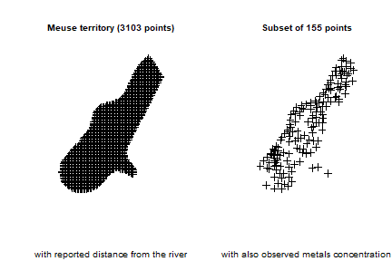
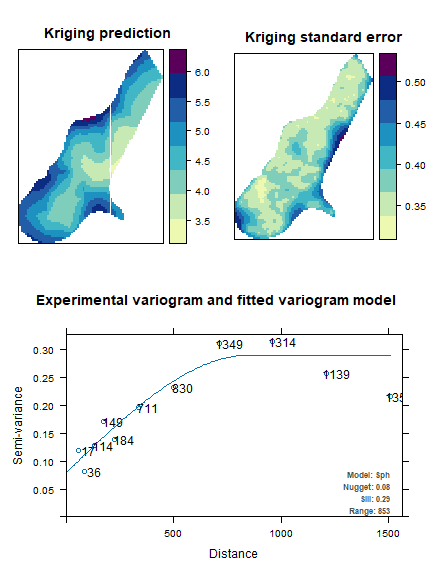
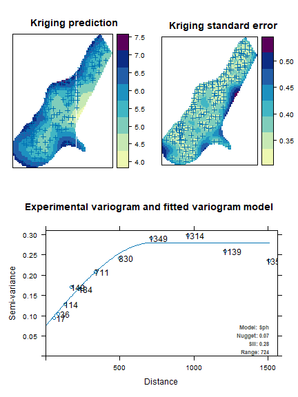
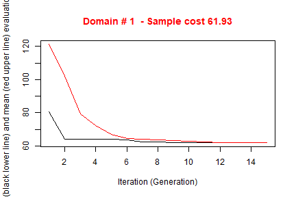
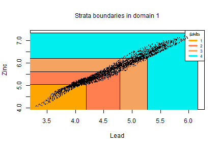
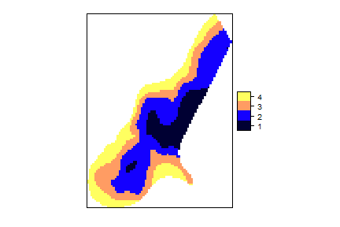
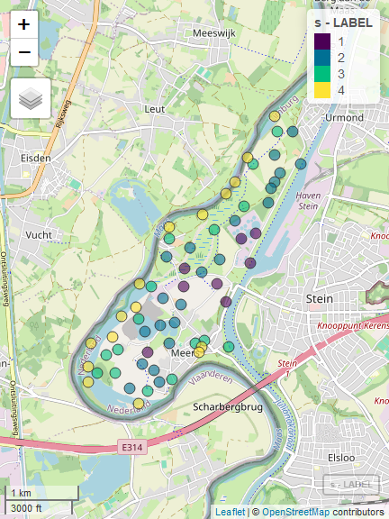

# Optimization with the *spatial* method

Let us suppose we want to design a sample survey with $k$ $Z$ target variables, each one of them correlated to one or more of the available $Y$ frame variables. 

When frame units are georeferenced or geocoded, the presence of spatial auto-correlation can be investigated. This can be done by executing for instance the Moran test on the target variables: if the null hypothesis is rejected (i.e. the hypothesis of the presence of spatial auto-correlation is accepted) then we should take into account also this variance component.

As indicated by @degruijter2016 and @degruijter2019, in case $Z$ is the target variable, omitting as negligible the *fpc* factor, the sampling variance of its estimated mean is:

\begin{equation} \label{eq1}
V(\hat{\bar{Z}}) = \sum_{h=1}^{H}(N_{h}/N)^{2} S_{h}^{2}/n_{h}
\end{equation}

We can write the variance in each stratum $h$ as:

\begin{equation} \label{eq2}
S_{h}^{2} = \dfrac{1}{N_{h}^{2}} \sum_{i=1}^{N_{h-1}}\sum_{j=i+1}^{N_{h}}(z_{i}-z_{j})^{2}
\end{equation} 

The optimal determination of strata is obtained by minimizing the quantity $O$:

\begin{equation} \label{eq3}
O = \sum_{h=1}^{H} \dfrac{1}{N_{h}^{2}} \{ \sum_{i=1}^{N_{h-1}}  \sum_{j=i+1}^{N_{h}} (z_{i}-z_{j})^{2}\}^{1/2}
\end{equation}

Obviously, values $z$ are not known, but only their predictions, obtained by means of a regression model. So, in Equation \ref{eq3} we can substitute $(z_{i}-z_{j})^{2}$ with 

\begin{equation} \label{eq5}
D_{ij}^{2} = \dfrac{(\tilde{z}_{i}-\tilde{z}_{j})^{2}}{R^{2}} + V(e_{i}) + V(e_{j}) - 2Cov(e_{i},e_{j})
\end{equation}

where $R^{2}$ is the squared correlation coefficient indicating the fitting of the regression model, and $V(e_{i})$, $V(e_{j})$ are the model variances of the residuals. The spatial auto-correlation component is contained in the term $Cov(e_{i},e_{j})$.

In particular, the quantity $D_{ij}$ is calculated in this way:

\begin{equation} \label{eq6}
D_{ij}^{2} = \dfrac{(\tilde{z}_{i}-\tilde{z}_{j})^{2}}{R^{2}} + (s_{i}^{2} + s_{j}^{2}) - 2 s_{i}  s_{j}  e^{-k (d_{ij}/range)}
\end{equation}

where $d_{ij}$ is the Euclidean distance between two units i and j in the frame (calculated using their geographical coordinates, that must be expressed in meters), the $s_{i}$ and $s_{j}$ are estimates of the prediction errors in the single points and *range* is the maximum distance below which spatial auto-correlation can be observed among points. The value of *range* can be determined by an analysis of the spatial *variogram*.


To summarize, when frame units can be geo-referenced, the proposed procedure is the following:

* acquire coordinates of the geographic location of the units in the population of interest;
*	fit a *kriging* model (or any other spatial model) on data for each $Z$;
* obtain predicted values together with prediction errors for each $Z$ and associate them to each unit in the frame;
* perform the optimization step.


# Example

In order to illustrate the "*spatial*" method, we make use of a dataset generally employed as an example of spatially correlated phenomena (in this case, the concentration of four heavy metals in a portion of the river Meuse). This dataset comes with the library "*sp*":


``` r
library(sp)
# locations (155 observed points)
data("meuse")
# grid of points (3103)
data("meuse.grid")
meuse.grid$id <- c(1:nrow(meuse.grid))
coordinates(meuse)<-c("x","y")
coordinates(meuse.grid)<-c("x","y")
```



We analyse the territorial distribution of the *lead* and *zinc* concentration, and model (by using the *universal kriging*) their relations with distance from the river, using the subset of 155 points on which these values have been jointly observed: 


``` r
library(automap)
kriging_lead = autoKrige(log(lead) ~ dist, meuse, meuse.grid)
```

```
## [using universal kriging]
```

``` r
plot(kriging_lead,sp.layout = NULL, justPosition = TRUE)
```



``` r
kriging_zinc = autoKrige(log(zinc) ~ dist, meuse, meuse.grid)
```

```
## [using universal kriging]
```

``` r
plot(kriging_zinc, sp.layout = list(pts = list("sp.points", meuse)))
```



It is possible to calculate the fitting of the two models in this way:


``` r
r2_lead <- 1 - kriging_lead$sserr/sum((log(meuse$lead)-mean(log(meuse$lead)))^2)
r2_lead
```

```
## [1] 0.9999997
```

``` r
r2_zinc <- 1 - kriging_zinc$sserr/sum((log(meuse$zinc)-mean(log(meuse$zinc)))^2)
r2_zinc
```

```
## [1] 0.9999999
```


Using these *kriging* models, we are able to predict the values of lead and zinc concentration on the totality of the 3,103 points in the Meuse territory:


``` r
df <- NULL
df$id <- meuse.grid$id
df$lead.pred <- kriging_lead$krige_output@data$var1.pred
df$lead.var <- kriging_lead$krige_output@data$var1.var
df$zinc.pred <- kriging_zinc$krige_output@data$var1.pred
df$zinc.var <- kriging_zinc$krige_output@data$var1.var
df$lon <- meuse.grid$x
df$lat <- meuse.grid$y
df$dom1 <- 1
df <- as.data.frame(df)
head(df)
```

```
##   id lead.pred  lead.var zinc.pred  zinc.var    lon    lat dom1
## 1  1  5.509360 0.1954937  6.736502 0.2007150 181180 333740    1
## 2  2  5.546006 0.1716895  6.785460 0.1749260 181140 333700    1
## 3  3  5.488913 0.1784052  6.698883 0.1826314 181180 333700    1
## 4  4  5.388320 0.1855561  6.558216 0.1906426 181220 333700    1
## 5  5  5.584415 0.1463018  6.841612 0.1465346 181100 333660    1
## 6  6  5.525538 0.1533757  6.749216 0.1549663 181140 333660    1
```

The aim is now to produce the optimal stratification of the 3,103 points under a precision constraint of 1% on the target estimates of the mean *lead*  and *zinc* concentrations:


``` r
library(SamplingStrata)
frame <- buildFrameSpatial(df=df,
                      id="id",
                      X=c("lead.pred","zinc.pred"),
                      Y=c("lead.pred","zinc.pred"),
                      variance=c("lead.var","zinc.var"),
                      lon="lon",
                      lat="lat",
                      domainvalue = "dom1")
cv <- as.data.frame(list(DOM=rep("DOM1",1),
                         CV1=rep(0.01,1),
                         CV2=rep(0.01,1),
                         domainvalue=c(1:1) ))
```

To this aim, we carry out the optimization step by indicating the method *spatial*:


``` r
set.seed(1234)
solution <- optimStrata (
  method = "spatial",
  errors=cv, 
  framesamp=frame,
  iter = 15,
  pops = 10,
  nStrata = 5,
  fitting = c(r2_lead,r2_zinc),
  range = c(kriging_lead$var_model$range[2],kriging_zinc$var_model$range[2]),
  kappa=1,
  writeFiles = FALSE,
  showPlot = FALSE,
  parallel = FALSE)
```

```
## 
## Input data have been checked and are compliant with requirements
## Sequential optimization as parallel = FALSE, defaulting number of cores = 1
##  *** Domain :  1   1
##  Number of strata :  3103
##  *** Sample cost:  61.92901
##  *** Number of strata:  4
```



```
## 
##  *** Sample size :  62
##  *** Number of strata :  4
## ---------------------------
```

``` r
framenew <- solution$framenew
outstrata <- solution$aggr_strata
```

obtaining the following optimized strata:


``` r
plotStrata2d(framenew,outstrata,domain=1,vars=c("X1","X2"),
             labels=c("Lead","Zinc"))
```


<table class="table table-condensed">
 <thead>
  <tr>
   <th style="text-align:right;"> Stratum </th>
   <th style="text-align:right;"> Population </th>
   <th style="text-align:right;"> Allocation </th>
   <th style="text-align:right;"> SamplingRate </th>
   <th style="text-align:right;"> Bounds Lead </th>
   <th style="text-align:right;"> Bounds Zinc </th>
  </tr>
 </thead>
<tbody>
  <tr>
   <td style="text-align:right;"> 1 </td>
   <td style="text-align:right;"> 468 </td>
   <td style="text-align:right;"> 8 </td>
   <td style="text-align:right;"> 0.01792501 </td>
   <td style="text-align:right;"> 3.3146468764848-4.19255285819977 </td>
   <td style="text-align:right;"> 4.06901686494286-5.05063630598842 </td>
  </tr>
  <tr>
   <td style="text-align:right;"> 2 </td>
   <td style="text-align:right;"> 1118 </td>
   <td style="text-align:right;"> 22 </td>
   <td style="text-align:right;"> 0.01945812 </td>
   <td style="text-align:right;"> 3.93768665105216-4.7764979731549 </td>
   <td style="text-align:right;"> 5.05229397991744-5.61689510336853 </td>
  </tr>
  <tr>
   <td style="text-align:right;"> 3 </td>
   <td style="text-align:right;"> 776 </td>
   <td style="text-align:right;"> 16 </td>
   <td style="text-align:right;"> 0.02008296 </td>
   <td style="text-align:right;"> 4.44641346310962-5.26600727214482 </td>
   <td style="text-align:right;"> 5.61793458171105-6.22421378893523 </td>
  </tr>
  <tr>
   <td style="text-align:right;"> 4 </td>
   <td style="text-align:right;"> 741 </td>
   <td style="text-align:right;"> 16 </td>
   <td style="text-align:right;"> 0.02186445 </td>
   <td style="text-align:right;"> 4.83281864156491-6.16276083528614 </td>
   <td style="text-align:right;"> 6.22619751326312-7.33803658123577 </td>
  </tr>
</tbody>
</table>

that can be visualised in this way:


``` r
frameres <- SpatialPointsDataFrame(data=framenew, coords=cbind(framenew$LON,framenew$LAT) )
frameres2 <- SpatialPixelsDataFrame(points=frameres[c("LON","LAT")], data=framenew)
frameres2$LABEL <- as.factor(frameres2$LABEL)
spplot(frameres2,c("LABEL"), col.regions=bpy.colors(5))
```



We can now proceed with the selection of the sample, using the function 'selectSampleSpatial' (which is a wrapper of function 'lpm2_kdtree' in package 'SamplingBigData', see @lisic2018b), in order to ensure a spatially balanced sample:


``` r
s <- selectSampleSpatial(framenew,outstrata,coord_names=c("LON","LAT"))
```

```
## 
## *** Sample has been drawn successfully ***
##  62  units have been selected from  4  strata
```

whose units are so distributed in the territory:


``` r
s <- selectSampleSpatial(framenew,outstrata,coord_names = c("LON","LAT"))
```

```
## 
## *** Sample has been drawn successfully ***
##  62  units have been selected from  4  strata
```

``` r
coordinates(s) <- ~LON+LAT
proj4string(s) <- CRS("+init=epsg:28992")
s$LABEL <- as.factor(s$LABEL)
library(mapview)
mapview(s,zcol="LABEL", map.types = c("OpenStreetMap"))
```




# References
